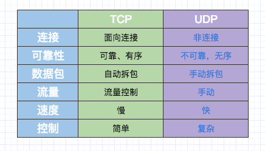
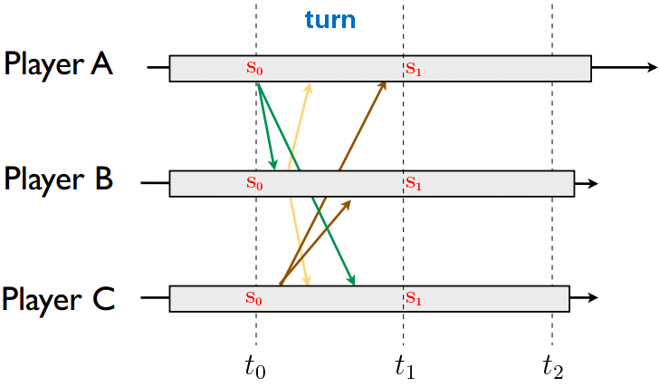
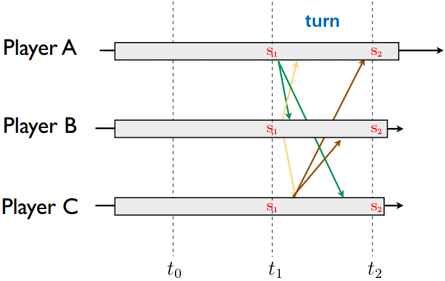

> 引自：[从王者荣耀聊聊游戏的帧同步](https://my.oschina.net/u/1859679/blog/1137723)

农药自从上线以来，依靠着强大的产品力以及腾讯的运营能力，在游戏市场上表现可谓是风生水起，根据第三方的调研数据显示，《王者荣耀》渗透率达到 22.3%，用户规模达到 2.01 亿人，每日的日活跃用户（DAU）均值为 5412.8 万人。 如此可观的数据，令人十分钦佩。

当然了，作为技术人，更愿意从技术上了解去一些王者荣耀的实现原理和架构方式，从中找到新的知识领域，扩展自己的知识边界，丰富自己的专业技能。借助这个游戏，这一篇我们来聊一聊王者荣耀的技术实现以及同步方式，更多的从 MOBA (多人在线战术竞争游戏) 方向来解析推理王者的实现方案，如若有分析的不尽的方向，欢迎一起探讨改进。以下是主要讲解的几个重点:

> 1. 服务器架构
> 2. 通信方式
> 3. 同步方案
> 4. 技能同步
> 5. 断线重连

 

# 一、服务器架构

不难发现，王者荣耀的服务器采用房间模式，每个玩家登陆以后，然后进入大厅，进行匹配游戏。匹配完成之后，把一起对战的玩家放到一个房间内进行对战。

房间类玩法和 MMORPG 有很大的不同，在于其在线广播单元的不确定性和广播数量很小，而且需要匹配一台房间服务器让少数人进入一个服务器。

这一类游戏最重要的是其 “游戏大厅” 的承载量，每个 “游戏房间” 受逻辑所限，需要维持和广播的玩家数据是有限的，但是 “游戏大厅” 需要维持相当高的在线用户数，所以一般来说，这种游戏还是需要做 “分服” 的。而 “游戏大厅” 里面最有挑战性的任务，就是 “自动匹配” 玩家进入一个 “游戏房间”，这需要对所有在线玩家做搜索和过滤，以及为了更好的体验，会对玩家进行分地区进行匹配，以方便获得更快速的同步。

一般的方式是玩家先登录 “大厅服务器”，然后选择组队游戏的功能，服务器会通知参与的所有游戏客户端，新开一条连接到房间服务器上，这样所有参与的用户就能在房间服务器里进行游戏交互了。

 

# 二、通信方式

说到通信方式，一般会有 http 和 socket 两种方式，但 http 底层也是采用 socket, 只是每次通信完成以后都会断开，这种方式对于需要频繁交互的双方来说，显得效率太低了，所以一般实时要求高的游戏都是采用 socket 方式来通信。

可是 sokect 通信，又分为两种：TCP vs UDP，具体是采用那种 socket 类型，需要具体来看游戏游戏类型。以下是两种类型的优劣:

从上面的对比中，我们可以会发现，关于 socket，我们想做的事情，tcp 都帮我们做了，我们只需要建立链接，然后像读写文件一样读写就可以了。而 udp 需要我们自己设计一切。看到这一切，你可能第一感觉就是采用 tcp 而非 udp，那么真实情况是如此么？基于游戏的业务以及场景不同，我可以明确的告诉你，王者荣耀是采用 udp 的，包括腾讯多数长链接手游都是采用 udp，这是为何？

## 1、tcp 保证数据可靠性是有代价的

tcp 能够保证数据包的可靠性和有序，这一切都帮你封装好了。TCP 发送一个数据包，等待一段时间，直到检测到数据包丢失了，如果没有接收到它的 ACK，接下来就重新发送丢失的数据包到目标计算机。重复的数据包将被丢弃在接收端，乱序的数据包将被重新排序。以此来保证数据包的可靠性和有序性。

但为了保证可靠和有序，就要保证 TCP 无论什么情况，只要数据包出错，就必须等待数据包的重发。这是什么意思呐，就是说，即使最新的数据已经到达，但还是不能访问这些数据包，新到的数据会被放在一个队列中，需要等待丢失的包重新发过来之后，所有数据没有丢失才可以访问。

如此，如果遇到网络环境太差或者不稳定，比如说国内的移动网络，或者是遭遇到了网络阻塞，出现一个数据包丢失，所有事情都需要停下来等待这个数据包重发。客户端会出现等待接收数据，玩家操作会出现卡顿以及响应不及时的现象。

## 2、udp 的可靠性 —DIY 手动组装

从上面我们可以知道 udp 主要在可靠性上主要是不能保证数据包的顺序，比如第 100 个收到的数据包并不一定是第 100 个发出的数据包，同时也无法保证不丢包，期间有一个包丢失，udp 本是也不会去校检。如果这两个问题解决了，udp 的大部分可靠性问题也就解决了。

具体的方案我们这一篇就不在细说，大体上是如此来解决:

> 1、为每个数据包增加序列号，每发一次包，增加本地序号。
>
> 2、每个数据包增加一段位域，用来容纳多个确认符。确认字符多少个，跟进应用的发包速率来觉得，速率越高，确认字符的数量也相应越多。
>
> 3、每次收到包，把收到的包上序列号变为确认字符，发送包的时候带上这些确认字符。
>
> 4、如果从确认字符里面发现某个数据包有丢失，把它留给应用程序来编写一个包含丢失数据的新的数据包，必要的话，这个包还会用一个新的序列号发送。
>
> 5、针对多次收到同一包的时候可以放弃它

# 三、同步方案

游戏中常见的同步方案，有状态同步和帧同步，一般大型的 MMOARPG 都是采用的是状态同步，比如魔兽世界，状态同步采用 C/S 架构，所有的状态由服务器来控制，安全性比较高，但是流量比较大。帧同步采用的是囚徒模式，所有 c 端强制采用一个逻辑帧率，从而保证输出一致，其特点是流量小，安全性比较差。

王者荣耀采用的就是帧同步，那么具体帧同步是什么，如何实现的，我们从两个地方来分解：

## 1、帧率

什么是帧率，可能没有做过 client 同学并不是很清楚这个术语，我们从一个小李子来讲解一下。我记得小时候有一种小人书，快速翻看就可以看到漫画上的人物会动起来。如下面这种：

> 超过 1M 上传不删了，我也无奈

 

由于人类眼睛的特殊生理结构，如果所看画面之帧率高于每秒约 10-12 帧的时候，就会认为是连贯的， 此现象称之为视觉暂留。这也就是为什么电影胶片是一格一格拍摄出来，然后快速播放的，就像上图快速翻小人书一样。

游戏中的所有动画也是采用这种方式来渲染，只不过帧率是有 GPU 来控制，你所看到的画面都是有都是有 GPU 一帧帧渲染的，比如 30 帧 /s，你所看到的画面就比较流畅了。而帧率越高你所看到的越流畅。

## 2、Lockstep— 帧同步

帧同步可以说是通过帧率延伸过来的，你可以把一个游戏看成一个巨大的状态机，所有的参与者都采用同一个逻辑帧率来不断的向前推进。

 

我们看如下 2 个图：

 

图中是 A、B、C 三个玩家的时间轴，这个时间轴不是电脑上的本地时间，而是 A、B、C 联机时定义的一个时间轴。虚线分隔出来时间片称为 turn，可以理解成一帧。箭头表示该玩家将自己的操作指令广播给其他玩家。

我们把一盘游戏看成一个大型的状态机，因为大家玩的是同一款的游戏，因此 F 是相同的，初始状态 S0 也是相同的。在第一个 turn 结束时，所有玩家都接收到了完全一样的输入 I，注意这里的 I 不是一个值，而是包含了当前游戏中所有玩家的操作指令集合。t1 时刻所有玩家的电脑自行计算结果。由于 F、S0 和 I 是固定的，所以每个玩家电脑上计算出的下一个状态 S1 一定是相同的。

所以通过上面我们可以知道：

 

> 1、我们把游戏的前进分为一帧帧，这里的帧和游戏的渲染帧率并不是一个，只是借鉴了帧的概念，自定义的帧，我们称为 turn。游戏的过程就是每一个 turn 不断向前推进，每一个玩家的 turn 推进速度一致。
>
>  
>
> 2、每一帧只有当服务器集齐了所有玩家的操作指令，也就是输入确定了之后，才可以进行计算，进入下一个 turn，否则就要等待最慢的玩家。之后再广播给所有的玩家。如此才能保证帧一致。
>
>  
>
> 3、Lockstep 的游戏是严格按照 turn 向前推进的，如果有人延迟比较高，其他玩家必须等待该玩家跟上之后再继续计算，不存在某个玩家领先或落后其他玩家若干个 turn 的情况。使用 Lockstep 同步机制的游戏中，每个玩家的延迟都等于延迟最高的那个人。
>
>  
>
> 4、由于大家的 turn 一致，以及输入固定，所以每一步所有客户端的计算结果都一致的。

我们来看看具体的执行流程:

 

上图中我们可以明显看到，这种囚徒模式的帧同步，在第二帧的时候，因为玩家 1 有延迟，而导致第二帧的同步时间发生延迟，从而导致所有玩家都在等待，出现卡顿现象。

# 四、乐观锁 & 断线重连

囚徒模式的帧同步，有一个致命的缺陷就是，若联网的玩家有一个网速慢了，势必会影响其他玩家的体验，因为服务器要等待所有输入达到之后再同步到所有的 c 端。另外如果中途有人掉线了，游戏就会无法继续或者掉线玩家无法重连，因为在严格的帧同步的情况下，中途加入游戏是从技术上来讲是非常困难的。因为你重新进来之后，你的初始状态和大家不一致，而且你的状态信息都是丢失状态的，比如，你的等级，随机种子，角色的属性信息等。 比如玩过早期的冰封王座都知道，一旦掉线基本这局就废了，需要重开，至于为何没有卡顿的现象，因为那时都是解决方案都是采用局域网的方式，所以基本是没有延迟问题的。

后期为了解决这个问题，如今包括王者荣耀，服务器会保存玩家当场游戏的游戏指令以及状态信息，在玩家断线重连的时候，能够恢复到断线前的状态。不过这个还是无法解决帧同步的问题，因为严格的帧同步，是要等到所有玩家都输入之后，再去通知广播 client 更新，如果 A 服务器一直没有输入同步过来，大家是要等着的，那么如何解决这个问题？

采用 “定时不等待” 的乐观方式在每次 Interval 时钟发生时固定将操作广播给所有用户，不依赖具体每个玩家是否有操作更新。如此帧率的时钟在由服务器控制，当客户端有操作的时候及时的发送服务器，然后服务端每秒钟 20-50 次向所有客户端发送更新消息。如下图:

上图中，我们看到服务器不会再等到搜集完所有用户输入再进行下一帧，而是按照固定频率来同步玩家的输入信息到每一个 c 端，如果有玩家网络延迟，服务器的帧步进是不会等待的，比如上图中，在第二帧的时候，玩家 A 的网速慢，那么他这个时候，会被网速快的玩家给秒了（其他游戏也差不多）。但是网速慢的玩家不会卡到快的玩家，只会感觉自己操作延迟而已。

# 五、技能同步

游戏中有很多是和概率相关的，比如说技能的伤害有一定概率的暴击伤害或者折光被击等。按照帧同步的话，基于相同的输入，每个玩家的 client 都是独立计算伤害的，那么如何保证所有电脑的暴击伤害一致那。这个时候就需要用到伪随机了。

大部分编程语言内置库里的随机数都是利用线性同余发生器产生的，如果不指定随机种子（Random Seed），默认以当前系统时间戳作为随机种子。一旦指定了随机种子，那么产生的随机数序列就是确定的。就是说两台电脑采用相同的随机种子，第 N 次随机的结果是一致的。

所以在游戏开始前，服务器为每个玩家分配一个随机种子，然后同步给 client，如此每个 client 在计算每个角色的技能时候，就能保证伤害是一致的。这也是多数帧同步游戏采用的方案，包括王者荣耀。