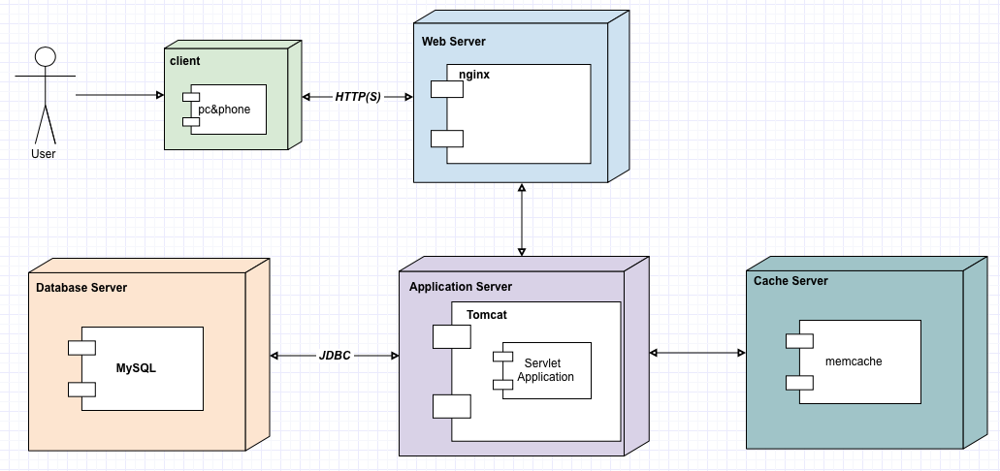
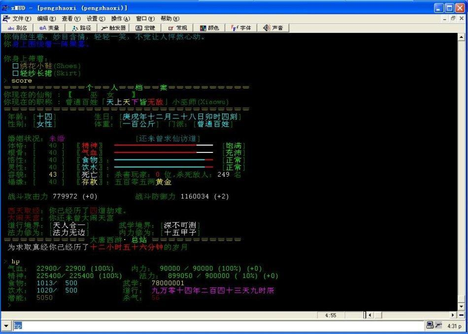
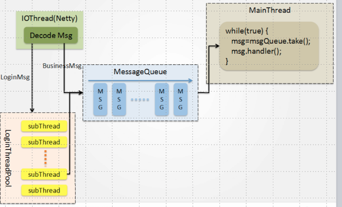
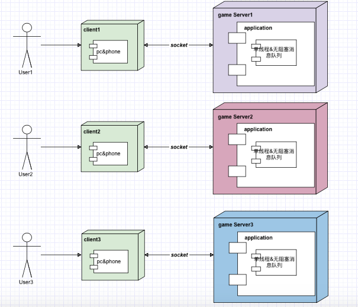
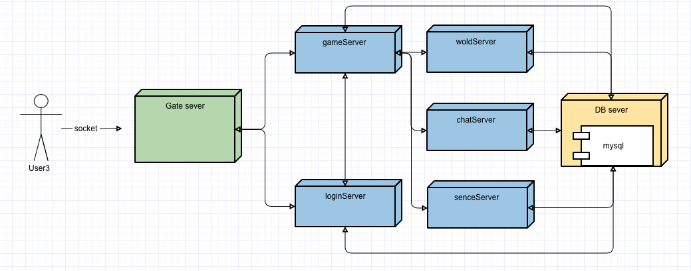
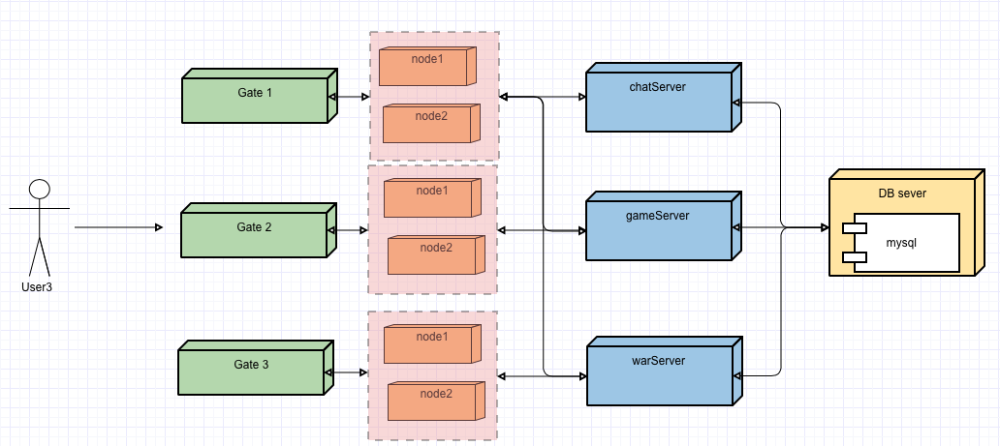
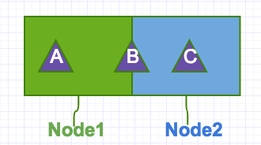
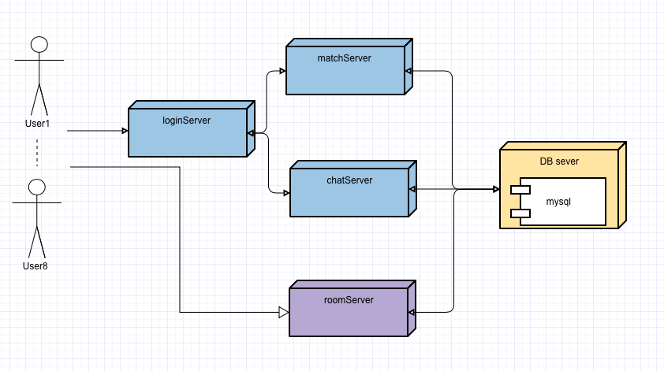

# 一、游戏服务器特征

游戏服务器，是一个会长期运行程序，并且它还要服务于多个不定时，不定点的网络请求。所以这类服务的特点是要特别关注稳定性和性能。这类程序如果需要多个协作来提高承载能力，则还要关注部署和扩容的便利性；同时，还需要考虑如何实现某种程度容灾需求。由于多进程协同工作，也带来了开发的复杂度，这也是需要关注的问题。

功能约束，是架构设计决定性因素。基于游戏业务的功能特征，对服务器端系统来说，有以下几个特殊的需求：

> 游戏和玩家的数据存储落地
>
> 对玩家交互数据进行广播和同步
>
> 重要逻辑要在服务器上运算，做好验证，防止外挂。

针对以上的需求特征，在服务器端，我们往往会关注对电脑内存和 CPU 的使用，以求在特定业务代码下，能尽量满足高承载低响应延迟的需求。最基本的做法就是 “空间换时间”，用各种缓存的方式来以求得 CPU 和内存空间上的平衡。另外还有一个约束：带宽。网络带宽直接限制了服务器的处理能力，所以游戏服务器架构也必定要考虑这个因素。

# 二、游戏服务器架构要素

   对于游戏服务端架构，最重要的三个部分就是，如何使用 CPU、内存、网卡的设计：

> 内存架构：主要决定服务器如何使用内存，以最大化利用服务器端内存来提高承载量，降低服务延迟。
>
> 逻辑架构：设计如何使用进程、线程、协程这些对于 CPU 调度的方案。选择同步、异步等不同的编程模型，以提高服务器的稳定性和承载量。可以分区分服，也可以采用世界服的方式，将相同功能模块划分到不同的服务器来处理。
>
> 通信模式：决定使用何种方式通讯。基于游戏类型不同采用不同的通信模式，比如 http,tcp,udp 等。

# 三、服务器演化进程

## 1、卡牌等休闲游戏弱交互游戏

服务器基于游戏类型不同，所采用的架构也有所不同，我们先讲一下简单的模型，采用 http 通信模式架构的服务器:

这种服务器架构和我们常用的 web 服务器架构差不多，也是采用 nginx 负载集群支持服务器的水平扩展，memcache 做缓存。唯一不同的地点不同的在于通信层需要对协议再加工和加密，一般每个公司都有自己的一套基于 http 的协议层框架，很少采用开源框架。

 

## 2、长链接游戏服务器

长连接游戏和弱联网游戏不同的地方在于，长连接中，玩家是有状态的，服务器可以时时和 client 交互，数据的传送，不像弱联网一般每次都需要重新创建一个连接，消息传送的频率以及速度上都快于弱联网游戏。长链接网游的架构经过几代的迭代，类型也变得日益丰富，以下为每一代服务器的特点以及架构模式。

 

### 1)、第一代网游服务器（单线程无阻塞）

最早的游戏服务器是 1978 年，英国著名的财经学校 University of Essex 的学生 Roy Trubshaw 编写了世界上第一个 MUD 程序，叫做《MUD1》。

MUD1 是一款纯文字的世界，没有任何图片，但是不同计算机前的玩家可以在游戏里共同冒险、交流。与以往具有网络联机功能的游戏相比，MUD1 是第一款真正意义上的实时多人交互的网络游戏，它最大的特色是能够保证整个虚拟世界和玩家角色的持续发展 —— 无论是玩家退出后重新登录还是服务器重启，游戏中的场景、宝箱、怪物和谜题仍保持不变，玩家的角色也依然是上次的状态。

MUD 中文版

MUDOS 使用单线程无阻塞套接字来服务所有玩家，所有玩家的请求都发到同一个线程去处理，主线程每隔 1 秒钟更新一次所有对象（网络收发，对象状态，刷新地图，刷新 NPC）。用户使用 Telnet 之类的客户端用 Tcp 协议连接到 MUDOS 上，使用纯文字进行游戏，每条指令用回车进行分割。这样的系统在当时每台服务器承载个 4000 人同时游戏。从 1991 年的 MUDOS 发布后，全球各地都在为他改进，扩充，推出新版本。

 

MUDOS 中游戏内容通过 LPC 脚本进行定制，逻辑处理采用单线程 tick 轮询，这也是第一款服务端架构模型，后来被应用到不同游戏上。后续很多游戏都是跟《UO》一样，直接在 MUDOS 上进行二次开发，直到 如今，一些回合制游戏，以及对运算量小的游戏，依然采用这种服务器架构。

 

第一代服务器架构图:

线程模型

​

### 2) 、第二代网游服务器（分区分服）

2000 年左右，随着图形界面的出现，游戏更多的采用图形界面与用户交互。此时随着在线人数的增加和游戏数据的增加，服务器变得不抗重负。于是就有了分服模型。分服模型结构如下：

分服模型是游戏服务器中最典型，也是历久最悠久的模型。在早期服务器的承载量达到上限的时候，游戏开发者就通过架设更多的服务器来解决。这样提供了很多个游戏的 “平行世界”，让游戏中的人人之间的比较，产生了更多的空间。其特征是游戏服务器是一个个单独的世界。每个服务器的帐号是独立的，每台服务器用户的状态都是不一样的，一个服就是一个世界，大家各不牵扯。

后来游戏玩家呼吁要跨服打架，于是就出现了跨服战，再加上随着游戏的运行，单个服务器的游戏活跃玩家越来越少，所以后期就有了服务器的合并以及迁移，慢慢的以服务器的开放、合并形成了一套成熟的运营手段。目前多数游戏还采用分服的结构来架设服务器，多数页游还是采用这种模式。

#### 线程调度

分服虽然可以解决服务器扩展的瓶颈，但单台服务器在以前单线程的方式来运行，没办法充分利用服务器资源，于是又演变出了以下 2 种线程模型。

> 异步 - 多线程，基于每个场景（或者房间），分配一个线程。每个场景的玩家同属于一个线程。游戏的场景是固定的，不会很多，如此线程的数量可以保证不会不断增大。每个场景线程，同样采用 tick 轮询的方式，来定时更新该场景内的（对象状态，刷新地图，刷新 NPC）数据状态。玩家如果跨场景的话，就采用投递和通知的方式，告知两个场景线程，以此更新两个场景的玩家数据。
>
>  
>
> 多进程。由于单进程架构下，总会存在承载量的极限，越是复杂的游戏，其单进程承载量就越低，因此一定要突破进程的限制，才能支撑更复杂的游戏。多进程系统的其他一些好处：能够利用上多核 CPU 能力、更容易进行容灾处理。
>
>  

### 多进程系统比较经典的模型是 “三层架构”，比如，基于之前的场景线程再做改进，把网络部分和数据库部分分离为单独的进程来处理，逻辑进程专心处理逻辑任务，不合 IO 打交道，网络 IO 和磁盘 IO 分别交由网路进程和 DB 进程处理。

 

### 3)、第三代网游服务器

之前的网游服务器都是分区分服，玩家都被划分在不同的服务器上，每台服务器运行的逻辑相同，玩家不能在不同服务器之间交互。想要更多的玩家在同一世界，保持玩家的活跃度，于是就有了世界服模型了。世界服类型也有以下 3 种演化:

 

#### 一类型（三层架构）

网关部分分离成单端的 gate 服务器，DB 部分分离为 DB 服务器，把网络功能单独提取出来，让用户统一去连接一个网关服务器，再有网关服务器转发数据到后端游戏服务器。而游戏服务器之间数据交换也统一连接到网管进行交换。所有有 DB 交互的，都连接到 DB 服务器来代理处理。

​

#### 二类型（cluster）

有了一类型的经验，后续肯定是拆分的越细，性能越好，就类似现在微服务，每个相同的模块分布到一台服务器处理，多组服务器集群共同组成一个游戏服务端。一般地，我们可以将一个组内的服务器简单地分成两类：场景相关的（如：行走、战斗等）以及场景不相关的（如：公会聊天、不受区域限制的贸易等）。经常可以见到的一种方案是：gate 服务器、场景服务器、非场景服务器、聊天管理器、AI 服务器以及数据库代理服务器。如下模型:

 

以上中我们简单的讲下常见服务器的三种类型功能:

> 场景服务器：它负责完成主要的游戏逻辑，这些逻辑包括：角色在游戏场景中的进入与退出、角色的行走与跑动、角色战斗（包括打怪）、任务的认领等。场景服务器设计的好坏是整个游戏世界服务器性能差异的主要体现，它的设计难度不仅仅在于通信模型方面，更主要的是整个服务器的体系架构和同步机制的设计。
>
>  
>
> 非场景服务器：它主要负责完成与游戏场景不相关的游戏逻辑，这些逻辑不依靠游戏的地图系统也能正常进行，比如公会聊天或世界聊天，之所以把它从场景服务器中独立出来，是为了节省场景服务器的 CPU 和带宽资源，让场景服务器能够尽可能快地处理那些对游戏流畅性影响较大的游戏逻辑。
>
>  
>
> 网关服务器：在类型一种的架构中，玩家在多个地图跳转或者场景切换的时候采用跳转的模式，以此进行跳转不同的服务器。还有一种方式是把这些服务器的节点都通过网关服务器管理，玩家和网关服务器交互，每个场景或者服务器切换的时候，也有网关服务器统一来交换数据，如此玩家操作会比较流畅。

通过这种类型服务器架构，因为压力分散了，性能会有明显提升，负载也更大了，包括目前一些大型的 MMORPG 游戏就是采用此架构。不过每增加一级服务器，状态机复杂度可能会翻倍，导致研发和找 bug 的成本上升，这个对开发组挑战比较大，没有经验，很容出错。

 

#### 三类型（无缝地图）

 魔兽世界的中无缝地图，想必大家印象深刻，整个世界的移动没有像以往的游戏一样，在切换场景的时候需要 loading 等待，而是直接行走过去，体验流畅。

现在的游戏大地图采用无缝地图多数采用的是 9 宫格的样式来处理，由于地图没有魔兽世纪那么大，所以采用单台服务器多进程处理即可，不过类似魔兽世界这种大世界地图，必须考虑 2 个问题：

> 1、多个地图节点如何无缝拼接，特别是当地图节点比较多的时候，如何保证无缝拼接
>
> 2、如何支持动态分布，有些区域人多，有些区域人少，保证服务器资源利用的最大化

为了解决这个问题，比较以往按照地图来切割游戏而言，无缝世界并不存在一块地图上面的人有且只由一台服务器处理了，此时需要一组服务器来处理，每台 Node 服务器用来管理一块地图区域，由 NodeMaster（NM）来为他们提供总体管理。更高层次的 World 则提供大陆级别的管理服务。

​

一个 Node 所负责的区域，地理上没必要连接在一起，可以统一交给一个 Node 去管理，而这些区块在地理上并没有联系在一起的必要性。一个 Node 到底管理哪些区块，可以根据游戏实时运行的负载情况，定时维护的时候进行更改 NodeMaster 上面的配置。

#### 对象的无缝迁移

####  

玩家 A、B、C 分别代表 3 种不同的状态，以及不同的迁移方式，我们分别来看。

> - 玩家 A: 玩家 A 在 node1 地图服务器上，由 node1 控制，如果迁移到 node2 上，需要将其数据复制到 node2 上，然后从 node1 移除。
> - 玩家 B: 玩家 B 在 node1 和 node2 中间，此时由 node1 和 node2 维护，若是从 node1 行走到 node2 的过程中，会向 1 请求，同时向 2 请求，待全部移动过去了再移除。
> - 玩家 C: 玩家 C 在 node2 地图服务器上，由 node2 控制，如果迁移到 node1 上，需要将其数据复制到 node1 上，然后从 node2 移除。

具体魔兽世界服务器的分析，篇幅过多，我们以后再聊。

 

## 3、房间服务器（游戏大厅）

房间类玩法和 MMORPG 有很大的不同，在于其在线广播单元的不确定性和广播数量很小。而且需要匹配一台房间服务器让少数人进入一个服务器。

这一类游戏最重要的是其 “游戏大厅” 的承载量，每个 “游戏房间” 受逻辑所限，需要维持和广播的玩家数据是有限的，但是 “游戏大厅” 需要维持相当高的在线用户数，所以一般来说，这种游戏还是需要做 “分服” 的。典型的游戏就是《英雄联盟》这一类游戏了。而 “游戏大厅” 里面最有挑战性的任务，就是 “自动匹配” 玩家进入一个 “游戏房间”，这需要对所有在线玩家做搜索和过滤。

玩家先登录 “大厅服务器”，然后选择组队游戏的功能，服务器会通知参与的所有游戏客户端，新开一条连接到房间服务器上，这样所有参与的用户就能在房间服务器里进行游戏交互了。

 

# **四、最后**

游戏行业相对于互联网应用来说，其开放性和标准化并不完善，这就导致了很其他行业看游戏有一种神秘面纱，隐秘而封闭。

造成这个原因有很多，游戏业务的复杂性以及受众群体小是主要原因，它不像 web 应用天生有开源组织和社区基因的支持，也没有互联网行业的如此大的受众面和影响力，除了一些比较出名的游戏引擎以外其他的功能组建都是有各个游戏公司基于自己业务逻辑自己搭建，每个公司业务方向不同又加大了知识的流通以及标准的建立，这对整个生态的发展已经产生了制约，特别是那些想加入游戏行业的新人来说，准入门槛较高，网上可找到的学习资料也很少。

这种现象目前正在发生改变，除了受众群体越来越大和丰富以外，还有一些技术组织正在推进整个社区的进步。

比如每年一度的 unity 技术大会，以及其他优秀的开源引擎都在积极推进整个游戏社区的创建，除了吸引更多优秀的技术人才和团队加入，这一切都让游戏行业变得越来越开放和规范，让行业内的知识也得以流通和继承。当然了，也期望每个游戏人能够加入进来，分享自己的知识，让自由开放的共享精神传承每个地方