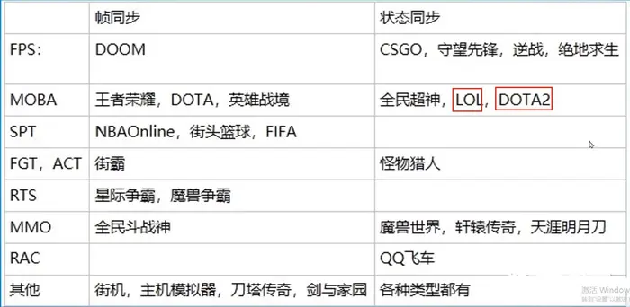

## 前言

总结一些游戏相关的概念和技术. 

这里不关注单机游戏, 我们只关注多人联机网络游戏. 因为单机游戏不需要有游戏服存在, 其中的账号、存档功能直接交给公共服务负责即可.

### 同步技术

游戏中的同步技术, 主要是三种:

* 帧同步：发操作、收操作。如果需要不卡客户端，可以使用了乐观帧，只同步一段时间内已有的操作
  1. 客户端上传操作指令
  2. 服务器转发广播给其它客户端
  3. 客户端表现
* 状态同步：发操作、收状态。
  1. 客户端上传操作指令
  2. 服务端计算
  3. 广播下发状态
  4. 各客户端播放状态
* 结果同步: 是一种更加特殊的状态同步, 常用于回合制. 服务器只需要确保每回合结果最终一致即可

这里先感性的对比下状态同步和帧同步的区别:

> 最大的区别就是战斗核心逻辑写在哪，状态同步的战斗逻辑在服务端，帧同步的战斗逻辑在客户端。帧同步下，服务端只是负责转发客户端的操作

|                        | 帧同步                                                       | 状态同步                                           |
| ---------------------- | ------------------------------------------------------------ | -------------------------------------------------- |
| 服务器代码复杂度       | 只负责转发                                                   | 大量服务器路基                                     |
| 客户端代码复杂度       | 按单机方式开发，必须保证每个玩家客户端计算结果一致 随机数、字典不能用；数学和物理引擎稳定，不能用浮点数和unity引擎 | 根据返回的结果进行客户端数据更新和画面表现即可     |
| 中途加入游戏或断线重连 | 需要追帧                                                     | 下发状态数据即可                                   |
| 服务器带宽要求         | 只传递操作，开销小                                           | 每个受控对象都要传状态（不光是主角）               |
| 客户端游戏体验         | 本地运算，反应灵敏，打击感强                                 | 有一定延迟                                         |
| 反作弊                 | 需要服务器和所有客户端协助                                   | 服务器权威                                         |
| 离线战斗               | 支持                                                         | 不支持                                             |
| 战斗回放               | 记录操作即可，文件小                                         | 记录视频，文件大；                                 |
| 网络延迟要求           | 高。根据统计玩家至少要在50ms~100ms可以完成一帧               | 较低。但取决于游戏，如lol需要采用udp等技术降低延迟 |

**总结**：选择哪种同步方式，都不是完美的，总有它的优点，也有要面临解决的问题。

### 语言选择

游戏服对比web服，具有如下特点：

1. 长连接
2. 有状态服务
3. 启动时间长
4. 开发周期短，基本每周都需要维护更新

基于以上特点，游戏服需要实现热更新操作，这点直接影响开发语言的选择。目前主要有：

#### C++搭配脚本语言：

C++来实现底层的框架（网络、与数据库通信等），接收到数据包之后，将数据传递给脚本层，由脚本来处理具体的业务逻辑。由于嵌入到进程里面的脚本语言引擎，本质上是将脚本语言代码翻译成内存中的Opcode来执行，因此这类型游戏服务器实现“热更新”方案很简单：将新的脚本同步到服务器上，然后给服务器发出一个信号，重新读取脚本代码到内存中即可。

#### 编译型语言实现热更新：

编译型语言需要重启服务器进行更新，这主要是导致两个问题：

- 客户端连接需要断开，因为游戏服务是长连接。
- 重启服务器时需要耗费大量的时间将持久化存储的数据加载到内存中，这样启停过程中的客户端请求就会丢失。

解决方法依次为：

* 维护客户端连接，可以再引入一个网关组件，由网关来维护连接。当新版本服务器启动完毕之后，向网关发送一个指令，让网关在收到这个指令之后的所有客户端请求，都转发到新的游戏服务器上，这样就完成了一个看似没有重启的“热更新”。
* 考虑将数据存入共享内存中，这样即便进程退出共享内存还存在。这样做的思路是“代码与数据分离”，要做到以下两点：
  - 设计一套面向共享内存的数据结构，至少应该能支持常见的链表、数组、字典等类型。
  - 数据结构的设计需要考虑可扩展性以及前后兼容性，因为可能出现两个前后版本中，有一些字段不存在或者有一些字段新增的情况。

#### 方案对比

以下来对比一下两种技术方案的优缺点。

| 特性     | 脚本型游戏服务器 | 编译型游戏服务器 | 备注                                                         |
| -------- | ---------------- | ---------------- | ------------------------------------------------------------ |
| 开发效率 | 高               | 低               | 脚本语言没有编译步骤                                         |
| 性能     | 低               | 高               | 脚本语言执行性能不如编译型语言                               |
| 架构难度 | 低               | 高               | 编译型语言为了实现热更新，需要解决： 网关维护连接， 代码数据分离，数据存入共享内存等，而脚本型语言只需要实现热更新脚本即可 |
| 重构难度 | 高               | 低               | “脚本语言一时爽，代码重构火葬场”                             |

