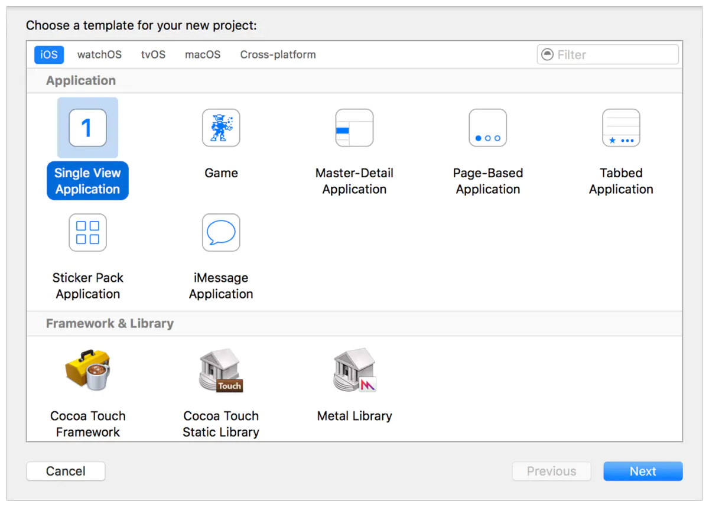

## 介绍

虽然苹果官方已经不再支持armv7、armv7s架构的CPU，但是仍有不少旧系统手机需要使用我们的应用。由于golang 14.15仍能支持编译armv7架构库，理论上也能支持在armv7s中运行。但为验证是否能正常运行，我们需要实际进行模拟；

### 虚机还是黑苹果

限于本人是自由的linux党, 对于mac系统的使用仍不太适应, 所以不可能使用mac来工作和开发. 只能选择虚机或黑苹果. 而**由于黑苹果需要专门搞台机器, 代价太大**, 所以选择虚机来进行小范围尝试. 顶多就是编译运行速度慢了些, 还是可以接受的. 后面可以再根据需要申请黑苹果吧。

## 下载安装Xcode8

1. 在官网下载即可，连接：https://developer.apple.com/download/all/，搜索`xcode 8`，下载
2. 下载完成，直接拖入mac虚拟机，解压安装。注意，为了与其他版本共存，这里解压好后，将文件夹重命名`Xcode8.0`，再拖入`/Applications/`目录下，就完成了安装
3. 如果需要删除，直接在`/Applications/`目录下删除对应版本文件夹即可
4. 命令行的话，则使用如下命令切换两个版本：
   * xcode-select -s /Applications/Xcode-9.4.1.app/Contents/Developer
   * xcode-select -p /Applications/Xcode-9.4.1.app/Contents/Developer

## 应用开发

这里记录下IOS应用的最基础的开发经验，避免遗忘，后面要用到可以快速捡起。

### 开发要求

* 一台Mac OS：可以使用虚拟机。不推荐黑苹果，就是把Mac OS改造后安装在非苹果的硬件上，比较难装有很多硬件bug。
* Xcode：多个xcode版本是可以通过简单修改文件夹名称共存的，方便对不同sdk和模拟器进行测试！安装方式见上文。
* 模拟器和SDK：安装Xcode时会自动安装iOS SDK和模拟器

### 语言基础

首先是语言选择：这里推荐选择objective-C！

* objective-C: 
  优点：可以直接和C、C++语言混用，调用C/C++库无需转换；对于编写demo验证sdk库是十分有利的。
  缺点：语法有些地方很反人类，参考：

  * [Apple官方教程](http://developer.apple.com/library/mac/#documentation/Cocoa/Conceptual/ProgrammingWithObjectiveC/Introduction/Introduction.html)
  * [维基上的Objective-C语言简介](http://zh.wikipedia.org/wiki/Objective-C)

* swift：
  优点：语言比较接近脚本语言，易于开发理解。

  缺点：调用C/C++库需要经过Objective-C封装和转换，和Android差不多比较繁琐。

### 应用参考

基于现有应用修改，会显著提高开发效率，减少犯错。以下是可以搜索参考的应用。

* [Apple官方的Sample Code](https://developer.apple.com/library/ios/navigation/#section=Resource Types&topic=Sample Code)
* [维基百科上的开源iOS App](http://en.wikipedia.org/wiki/List_of_free_and_open_source_iOS_applications)

简单的入门可以搜索[ToolBarSearch](https://developer.apple.com/library/ios/samplecode/ToolbarSearch/ToolbarSearch.zip)。

### 开发步骤

1. 打开Xcode8.0，在欢迎窗口，点击“Create a new Xcode Project” (或者选择 File > New > Project)。Xcode打开一个新窗口，显示一个让你选择模版的对话框。

2. 在对话框的顶部选择iOS。在Application区域，选择Single View Application，然后点击Next。
   

3. 在出现的对话框中，使用下面的值来命名你的应用，并为项目选择额外的选项
   

4. 在出现的对话框中，选择一个位置来存储你的项目，然后点击Create。Xcode在workspace window中打开新项目。在workspace窗口中，你或许会看到一个错误图标，它的信息显示“Singing for FoodTracker requires a development team.” 这个信息的意思是你没有为设置好iOS开发者信息，这个在发布到Apple Store上需要用到，现在忽略即可

5. Xcode面板认识：
   

6. 需要编辑的文件：
   

   * demoA：点击，即可进入项目配置主要配置项：
     * 1
   * ViewController.m：调整绑定的代码
   * Main.stoyboard：调整视图布局

7. 打开Main.stoyboard
   

8. 添加text field到场景中

   选择 Editor > Canvas，确保Show Bounds Rectangle被选中。
    这个设置使Interface Builder给画布中所有的视图绘制了蓝色的边框。很多视图和控制器有着透明的背景，很难看出它们的实际尺寸。当系统调整尺寸的时候，布局会发生错误，这会导致视图比你预期的要大或者小。启用这个设置会帮助你准确的理解在视图层级结构中都发生了什么。

   打开对象库。
    对象库位于Xcode右侧实用工具区的下部。如果你没有看到，在选择条上选择左起第三个按钮。（或者选择，View > Utilities > Show Object Library。）

   在对象库中，在过滤字段中输入text field可以快速找到Text Field对象。
   从对象库中**拖拽**一个Text Field对象到你的场景。

   

9. 设置text filed的占位文本

   维持text field被选中的状态，在实用工具区域（utility area）打开Attributes 检查器。
   当你在检查器选择器条上点击左起第四个按钮的时候，Attributes 检查器就出现了。
   它让你编辑在storyboard中的对象属性

   

10. 后续添加其他控件同理，不再赘述。

11. 下一步，我们看下如何将控件和值，控件和具体操作方法绑定：
    点击assistant editor，开启storyboard和代码双页视图

    

    按住Control（或者单机鼠标右键）从画布拖拽text filed到右侧编辑器的代码中，拖到刚添加的注释的下面然后停止。
    

    注意，如果鼠标拖到了已有代码上，则是绑定到已有代码。
    如果绑定了多次，则会依次触发多个代码的行为。要在控件上右键，删除多余的绑定。

基本的操作就是这些，后面的需要按具体情况在查找解决方法。

## 附录：设备一览表

## iPhone

| 设备              | 时间 | CPU       | 分辨率      | 大小 | 密度 | @Nx  | iOS系统       |
| ----------------- | ---- | --------- | ----------- | ---- | ---- | ---- | ------------- |
| iPhone            | 2007 | armv6     | 320 x 480   | 3.5  | 165  | @1x  | 1.0 - 3.1.3   |
| iPhone 3          | 2008 | armv6     | 320 x 480   | 3.5  | 165  | @1x  | 2.0 - 4.2.1   |
| iPhone 3s         | 2009 | armv7     | 320 x 480   | 3.5  | 165  | @1x  | 3.0 - 6.1.4   |
| iPhone 4 (gsm)    | 2010 | A4 armv7  | 640 x 960   | 3.5  | 330  | @2x  | 4.0 - 7.1.2   |
| iPhone 4 (cdma)   | 2011 | A4 armv7  | 640 x 960   | 3.5  | 330  | @2x  | 4.2.4 - 7.1.2 |
| iPhone 4s         | 2011 | A5 armv7  | 640 x 960   | 3.5  | 330  | @2x  | 5.0 - 9.3.5   |
| iPhone 5          | 2012 | A6 armv7s | 640 x 1136  | 4    | 326  | @2x  | 6.0 - 10.3.3  |
| iPhone 5c         | 2013 | A6 armv7s | 640 x 1136  | 4    | 326  | @2x  | 7.0 - 10.3.3  |
| iPhone 5s         | 2013 | A7 arm64  | 640 x 1136  | 4    | 326  | @2x  | 7.0 -         |
| iPhone 6          | 2014 | A8 arm64  | 750 x 1334  | 4.7  | 326  | @2x  | 8.0 -         |
| iPhone 6 Plus     | 2014 | A8 arm64  | 1242 x 2208 | 5.5  | 461  | @3x  | 8.0 -         |
| iPhone 6s         | 2015 | A9 arm64  | 750 x 1334  | 4.7  | 326  | @2x  | 9.0 -         |
| iPhone 6s Plus    | 2015 | A9 arm64  | 1242 x 2208 | 5.5  | 461  | @3x  | 9.0 -         |
| iPhone SE         | 2016 | A9 arm64  | 640 x 1136  | 4    | 326  | @2x  | 9.3 -         |
| iPhone 7          | 2016 | A10 arm64 | 750 x 1334  | 4.7  | 326  | @2x  | 10.0 -        |
| iPhone 7 Plus     | 2016 | A10 arm64 | 1242 x 2208 | 5.5  | 461  | @3x  | 10.0 -        |
| iPhone 8          | 2017 | A11 arm64 | 750 x 1334  | 4.7  | 326  | @2x  | 11.0 -        |
| iPhone 8 Plus     | 2017 | A11 arm64 | 1242 x 2208 | 5.5  | 461  | @3x  | 11.0 -        |
| iPhone X          | 2017 | A11 arm64 | 1125 x 2436 | 5.8  | 463  | @3x  | 11.0 -        |
| iPhone XS         | 2018 | A12 arm64 | 1125 x 2436 | 5.8  | 463  | @3x  | 12.0 -        |
| iPhone XS Max     | 2018 | A12 arm64 | 1242 x 2688 | 6.5  | 458  | @3x  | 12.0 -        |
| iPhone XR         | 2018 | A12 arm64 | 828 x 1792  | 6.1  | 326  | @2x  | 12.0 -        |
| iPhone 11         | 2019 | A13 arm64 | 828 x 1792  | 6.1  | 326  | @2x  | 13.0 -        |
| iPhone 11 Pro     | 2019 | A13 arm64 | 1125 x 2436 | 5.8  | 458  | @3x  | 13.0 -        |
| iPhone 11 Pro Max | 2019 | A13 arm64 | 1242 x 2688 | 6.5  | 458  | @3x  | 13.0 -        |
| iPhone SE 2       | 2020 | A13 arm64 | 750 x 1334  | 4.7  | 326  | @2x  | 13.0 -        |
| iPhone 12 mini    | 2020 | A14 arm64 | 2340 x 1080 | 5.4  | 476  | @3x  | 14.0 -        |
| iPhone 12         | 2020 | A14 arm64 | 2532 x 1170 | 6.1  | 460  | @3x  | 14.0 -        |
| iPhone 12 Pro     | 2020 | A14 arm64 | 2532 x 1170 | 6.1  | 460  | @3x  | 14.0 -        |
| iPhone 12 Pro Max | 2020 | A14 arm64 | 2778 x 1284 | 6.7  | 458  | @3x  | 14.0 -        |
| iPhone 13 mini    | 2021 | A15 arm64 | 2340 x 1080 | 5.4  | 476  | @3x  | 15.0 -        |
| iPhone 13         | 2021 | A15 arm64 | 2532 x 1170 | 6.1  | 460  | @3x  | 15.0 -        |
| iPhone 13 Pro     | 2021 | A15 arm64 | 2532 x 1170 | 6.1  | 460  | @3x  | 15.0 -        |
| iPhone 13 Pro Max | 2021 | A15 arm64 | 2778 x 1284 | 6.7  | 458  | @3x  | 15.0 -        |
| iPhone SE 3       | 2022 | A15 arm64 | 1334 x 750  | 4.7  | 326  | @2x  | 15.0 -        |
| iPhone 14         | 2022 | A15 arm64 | 2532 x 1170 | 6.1  | 460  | @3x  | 16.0 -        |
| iPhone 14 Plus    | 2022 | A15 arm64 | 2778 x 1284 | 6.7  | 458  | @3x  | 16.0 -        |
| iPhone 14 Pro     | 2022 | A16 arm64 | 2556 x 1179 | 6.1  | 460  | @3x  | 16.0 -        |
| iPhone 14 Pro Max | 2022 | A16 arm64 | 2796 x 1290 | 6.7  | 460  | @3x  | 16.0 -        |

注：屏幕大小单位为英寸(inch)，分辨率密度单位为ppi

## iPad

| 设备              | 发布年份 | CPU        | 分辨率      | @Nx  | iOS系统     |
| ----------------- | -------- | ---------- | ----------- | ---- | ----------- |
| iPad              | 2010     | A4 armv7   | 768 x 1024  | @1x  | 3.2 - 5.1.1 |
| iPad 2            | 2011     | A5 armv7   | 768 x 1024  | @1x  | 4.3 - 9.3.5 |
| iPad (3rd)        | 2012     | A5x armv7  | 1536 x 2048 | @2x  | 5.1 - 9.3.5 |
| iPad mini         | 2012     | A5 armv7s  | 768 x 1024  | @1x  | 6.0 - 9.3.5 |
| iPad (4rd)        | 2012     | A6x armv7s | 1536 x 2048 | @2x  | 6.0 -       |
| iPad Air          | 2013     | A7 arm64   | 1536 x 2048 | @2x  | 7.0 -       |
| iPad mini 2       | 2013     | A7 arm64   | 1536 x 2048 | @2x  | 7.0 -       |
| iPad Air 2        | 2014     | A8x arm64  | 1536 x 2048 | @2x  | 8.1 -       |
| iPad mini 3       | 2014     | A7 arm64   | 1536 x 2048 | @2x  | 8.1 -       |
| iPad mini 4       | 2015     | A8 arm64   | 1536 x 2048 | @2x  | 9.0 -       |
| iPad Pro (12.9)   | 2015     | A9x arm64  | 2048 x 2732 | @2x  | 9.1 -       |
| iPad Pro (9.7)    | 2016     | A9x arm64  | 1536 x 2048 | @2x  | 9.3 -       |
| iPad (5rd)        | 2017     | A9 arm64   | 1536 x 2048 | @2x  | 10.2.1 -    |
| iPad Pro (10.5)   | 2017     | A10x arm64 | 1668 x 2224 | @2x  | 10.3.2 -    |
| iPad Pro (12.9-2) | 2017     | A10x arm64 | 2048 x 2732 | @2x  | 10.3.2 -    |
| iPad (10.2)       | 2019     | A12 arm64  | 1620 x 2160 | @2x  | iPadOS      |
| iPad Pro (11)     | 2020     | A12x arm64 | 2388 x 1668 | @2x  | iPadOS 14   |
| iPad Pro (12.9)   | 2020     | A12x arm64 | 2732 x 2048 | @2x  | iPadOS 14   |
| iPad (10.2)       | 2021     | A13 arm64  | 2160 x 1620 | @2x  | iPadOS 15   |
| iPad mini (8.3)   | 2021     | A15 arm64  | 2266 x 1488 | @2x  | iPadOS 15   |
| iPad Air 5 (10.9) | 2022     | M1 arm64   | 2360 x 1640 | @2x  | iPadOS 15   |

## iPod touch

| 设备             | 发布年份 | CPU      | 分辨率     | @Nx  | iOS系统       |
| ---------------- | -------- | -------- | ---------- | ---- | ------------- |
| iPod touch       | 2007     | armv6    | 320 x 480  | @1x  | 1.1 - 3.1.3   |
| iPod touch (2nd) | 2008     | armv6    | 320 x 480  | @1x  | 2.1.1 - 4.2.1 |
| iPod touch (3rd) | 2009     | armv7    | 320 x 480  | @1x  | 3.1 - 5.1.1   |
| iPod touch (4th) | 2010     | A4 armv7 | 640 x 960  | @2x  | 4.1 - 6.1.4   |
| iPod touch (5th) | 2012     | A5 armv7 | 640 x 1136 | @2x  | 6.0 - 9.3.5   |
| iPod touch (6th) | 2015     | A8 arm64 | 640 x 1136 | @2x  | 8.4 -         |

