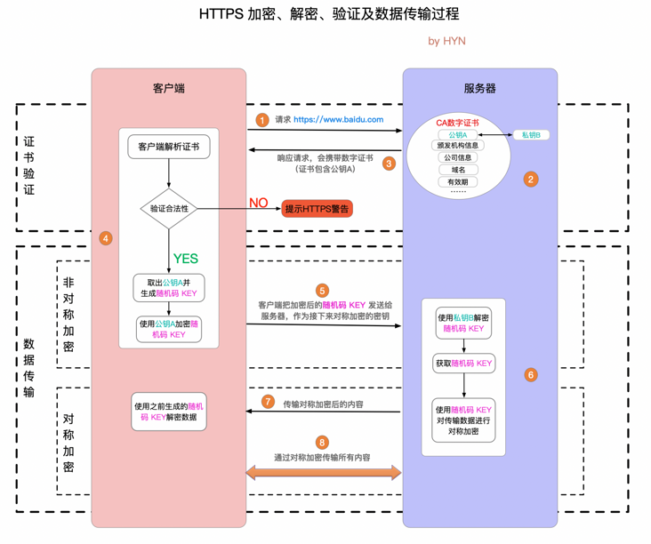

## 前言

做web开发测试时，不可避免需要和https协议打交道，虽然这个协议很繁琐很不优雅，但是不可否认它是成功的商业应用了。这里记录下它的原理以及对应解决的问题

## 预备知识

本文需要以下知识已经了解的基础上，才能比较好阅读理解：

* 对称加密：DES、3DES 和 AES
* 非对称加密：rsa；公钥加密，私钥解密
* 摘要：md5、sha系列；可以将任意长度的文本转换为较短的固定长度的二进制值，并且源文本一旦修改，那么它们的 hash 是不一样的
* 签名：rsa；私钥加密，公钥解密
* 证书：CA(数字证书管理机构)签发(用CA私钥加密)的文件

问题答疑：

1. 如何确定这个公钥的是不是真的是我发出的呢？（解决中间人攻击）
   我会向一个非常有公信力的 CA 申请，把我**域名、个人资料和公钥**提交给CA，CA确认 **luan.ma 域名是我的（通过DNS验证）**，并且确认我的信息是真实的。之后，CA会把 **我的信息 和 我的公钥** 制作成一个 **证书**，然后**用 CA 自己的私钥加密**（CA手里也有一对公钥和私钥，**注意这里CA只是加密了Hash摘要**），附上CA自己的名字。然后让我取回CA签发的**证书**。最大的CA公司是 DigiCert，常见的可以签发免费证书的CA有 诚信亚洲，let's encrypt 等。

   **证书可以公开发布，主要包含证书信息+公钥+证书签名**。证书信息除了域名、网站主信息、CA名称外，还有有效期，附加域名（加钱），公司名（加钱）等信息；
   案例：试想如果中间人拿到证书，它使用CA的公钥解密了，再进行篡改，但是因为它没有CA的私钥，如果用自己的私钥加密，发出来到达客户端，客户端验证无法找到权威CA的公钥，或者用公钥无法解密，就会报网站不安全。

2. CA的公钥要怎么获取呢？
   浏览器和操作系统预装了CA根证书。中级机构颁发的证书则通过证书链绑定进行验证，见下文说明。

3. 为什么要Hash摘要？
   证书正文（即证书信息+公钥）内容比较长，如果都进行加密会浪费带宽；所以对证书正文计算Hash，CA再对这个Hash用私钥做加密，得到的**就叫证书签名**。客户端拿到证书，使用CA的公钥解密证书签名得到HashA摘要，再用相同的Hash算法计算证书正文得到HashB，HashA==HashB则证书没有问题，里面的公钥就是可信的。
   
4. 证书等级和价格：证书信息包含（可被证书认证）的内容不同，价格就不同

5. 证书有效期：公司可能倒闭了，域名可能过期了，被接盘侠注册了，但是你还持有这个域名的证书，这是不合理，也不安全的，所以一般证书有效期都为一年，而较为宽松的 Let's encrypt 证书的有效期只有三个月。

使用nginx提供https服务，要求`ssl_certificate`填入的就是证书的路径，`ssl_certificate_key`填入的就是自己的私钥；一般证书命名为“xxx.cer”或“xxx.crt”，私钥命名为“xxx.key”

使用openssl解密证书：

```shell
# pem格式证书（默认是这种）；-noout不输出证书原文
openssl x509 -in cerfile.cer -noout -text
openssl x509 -inform pem -in cerfile.cer -noout -text
# der格式证书
openssl x509 -inform der -in cerfile.cer -noout -text
```

说明

- Root CA机构颁发的证书文件中只包含一份证书，中级机构颁发的证书中则包含多份证书，配置HTTPS时，**需要将服务器证书与中间证书拼接成一份完整的证书**后再上传

  - **证书链格式**

    中级机构颁发的证书链格式如下：

    ```
    -----BEGIN CERTIFICATE-----
    xxxx
    -----END CERTIFICATE-----
    -----BEGIN CERTIFICATE-----
    xxxx
    -----END CERTIFICATE-----
    -----BEGIN CERTIFICATE-----
    xxxx
    -----END CERTIFICATE-----
    ```

  - **拼接规则**

    通过文本编辑器打开所有*.PEM格式的证书文件，将服务器证书放在第一位，中间证书放在第二位，证书之间不能有空行。通常情况下，证书颁发机构颁发证书时会有对应的说明，请注意查阅规则说明。

- 注意如果cerfile.cer中有多张证书，openssl使用第一张

- CRT后缀文件是Certificate的简称，可能是PEM编码格式，也可能是DER编码格式。进行证书格式转换前请仔细确认您的证书格式是否需要转换。

- PEM（Privacy Enhanced Mail）一般为文本格式，以 “-----BEGIN xxx-----”开头，以 “-----END xxx-----结尾”，**中间的内容是Base64编码**。这种格式可以保存证书和私钥，为了区分证书与私钥，一般会将PEM格式的私钥后缀改为`.key`。

## 交互流程

