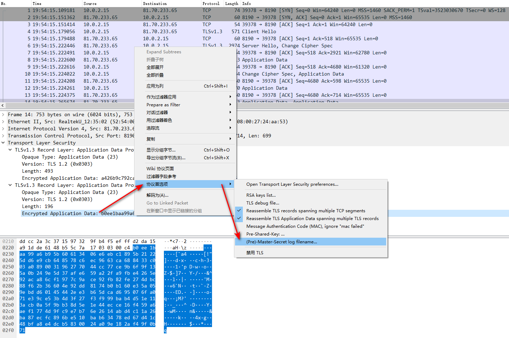
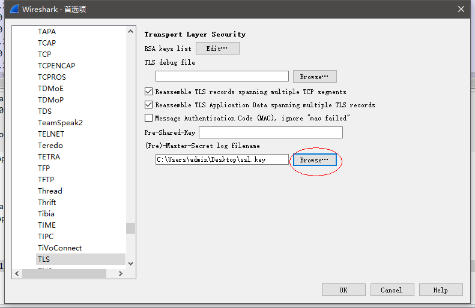
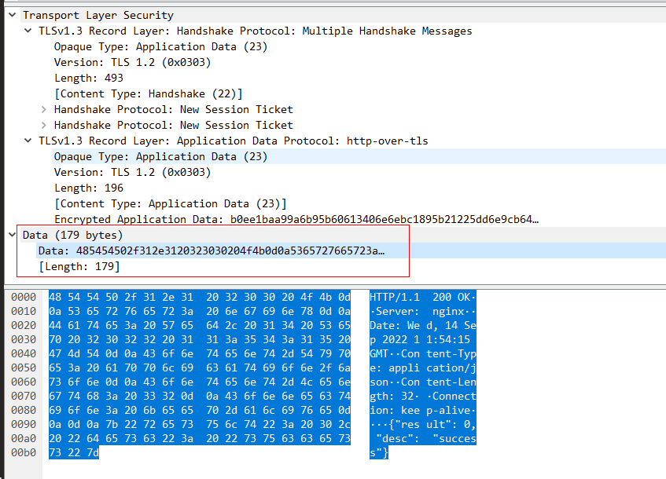

### wireshark和tcpdump

两者并不是竞争者关系, 相反tcpdump是主要用于获取抓包的数据源, 而wireshark则主要用于分析抓取到的数据包. 在tcpdump抓包输出上直接分析数据包是十分低效且不明智的.

### wireshark关注的网络协议信息

本节关注的各网络协议正常数据包的结构, 以便在抓包时能分辨不同的包.

##### arp

交换机的自动学习MAC地址功能, 使用的是其内容寻址寄存器(CAM)保存了每个端口所连接设备的MAC地址. 

本机要发送IP包, 继续要知道下一跳设备的MAC地址, 这就是通过arp请求来实现ip到mac地址的绑定. 

* arp请求: 这是一个广播包, 
  * 链路层源MAC是发送方的mac地址, 目标MAC是`ff:ff:ff:ff:ff:ff`. 
  * ARP头部标识了发送方ip和mac, 以及接收方的ip, 接收方mac未知, 所以为`00:00:00:00:00:00`, opcode为0x0001
* arp响应: 单播包, 链路层头和arp内容都是有效的. opcode为0x0002
* 无偿arp: 广播包, 和arp请求包结构相似, **唯一不同点是发送方ip和接收方ip是相同的**. 它的作用是为了通知其他设备本设备的**ip地址**被改变, arp缓存需要更新


##### ip协议

ip地址由网络地址部分和主机地址部分组成, 网络掩码就是用于区分ip地址中那一部分是网络地址部分, 那一部分是主机地址部分

ipv4头关键字段:

* 8bit，**服务类型 TOS**
  该段数据组成为 3bit 优先权字段(现已被忽略) + 4bit TOS 字段 + 1bit 保留字段(须为 0)。
  4bit TOS 字段分别表示最小时延、最大吞吐量、最高可用性和最小费用。只能置其中 1bit，全为 0 表示一般服务。**现在大多数的 TCP/IP 实现都不支持 TOS 特性** 。可以看到，本报文 TOS 字段为全 0。

* 8bit **生存时间 TTL**
  IP 报文所允许通过的路由器的最大数量。每经过一个路由器，TTL 减 1，当为 0 时，路由器将该数据报丢弃。TTL 字段是由发送端初始设置一个 8 bit 字段. 推荐的初始值由分配数字 RFC 指定。发送 ICMP 回显应答时经常把 TTL 设为最大值 255。TTL 可以防止数据报陷入路由循环

* 16bit **IP 首部校验和**

  由发送端填充。以本报文为例，先说这个值是怎么计算出来的。

  ```
  # 将校验和字段 16bit 值抹去变为 `0x0000`，然后将首部 20 字节值相加
  0x4560 + 0x0042 + 0x7567 + 0x0000 + 0x3d06 + 0x0000 + 0xC0A8 + 0x011A + 0xC0A8 +0x0116 = 0x27B95
  
  # 将上述结果的进位 2 与低 16bit 相加
  0x7B95 + 0x2 = 0x7B97
  
  # 0x7B97 按位取反
  ~(0x7B97) = 0x8468
  ```

  结果 `0x8468` 即为该字段值！
  接收端验证的时候，进行以下计算

  ```
  # 20B 首部值相加
  0x27B95 + 0x8468 = 0x2FFFD
  
  # 将上述结果的进位 2 与低 16bit 相加
  0xFFFD + 0x2 = 0xFFFF
  
  # 0xFFFF 按位取反
  ~(0xFFFF) = 0  <-- 正确
  ```

ip分片标记:

ip层发包时, 会比较数据包大小和网络设备接口的MTU值, 确定是否需要分片. 若进行了分片则会影响如下ip头字段

* 每个ip头的"16bit 总长度"字段是分片包的长度
* "16bit 标识"字段用来唯一的标识主机发送的每一个数据报, IP 报文分片时, 该标识字段值被**复制到所有数据分片**的标识字段中, 使得这些分片在达到最终目的地时可以通过判断相同的标识字段重新组成原先的数据
* "3bit 标志 + 13bit 片偏移"字段. 
  3bit 标志: 对应 R、DF、MF。目前只有后两位有效，DF 位：为 1 表示不分片，为 0 表示分片。MF：为 1 表示“更多的片”，**为 0 表示这是最后一片**。
  13bit 片位移：本分片在原先数据报文中相对首位的偏移位。(需要再乘以 8)


#### https抓包解密

有时, 我们需要对https包进行抓包分析, 但https包是加密的, 我们无法看到其中内容的正确与否, 这时使用wireshark进行分析就需要一些技巧, 这里记录一下:

1. 首先使用tcpdump抓包, 线上环境数据包较多, 可以使用`-W`和`-G`参数进行抓包文件大小限制

   ```shell
   sudo tcpdump -XXni enp0s3 host xxx.com -G 600 -W 20 -w ttt.pcap
   ```

2. 发起请求, 并保存SSL通信的密钥: 这里可以使用curl简单实现

   ```shell
   #指定本次请求的密钥保存地址
   export SSLKEYLOGFILE=~/ssl.key
   #简单发起请求即可将密钥保存到~/ssl.key
   curl 'https://xxx.com/info' --data-raw '{"data":"hello"}' -H 'Content-Type: application/json' -k
   ```

3. 然后使用wireshark分析, 先设置tls密钥: 打开「Preferences」- 「Protocols」 - 「TLS」, 设置ssl.key文件地址:

   

   

4. 设置完成后, wireshark就会自动解密, 显示出https数据包的真实内容:

   


### wireshark的分析和图形功能

统计:

* 端点和会话: 在Statistics->Endpoints和Statistics->Conversations中, 会对所有数据包按照地址(端点)统计, 和按照会话做统计
* 协议包统计: Statistics->Protocol Hierarchy
* 跟踪TCP流: 通过五元组表示一个tcp流, 点击任意一个包, 右键选中跟踪tcp流, 就可以只看到这个五元组的交互包信息.
* 数据包长度分布统计: Statistics->Packet Length 

图表:

* IO图表: Statistics->IO Graph. 这个用于显示每秒收到的不同包的个数曲线, 可以自己创建过滤器来对比不同包的曲线差异.
* 往返时间: Statistics->TCP Stream Graph->Round Trip Time Graph
* 数据流图: Statistics->Flow Graph
* 专家信息: Analyze->Export Info Composite. 对不同错误级别数据包的统计