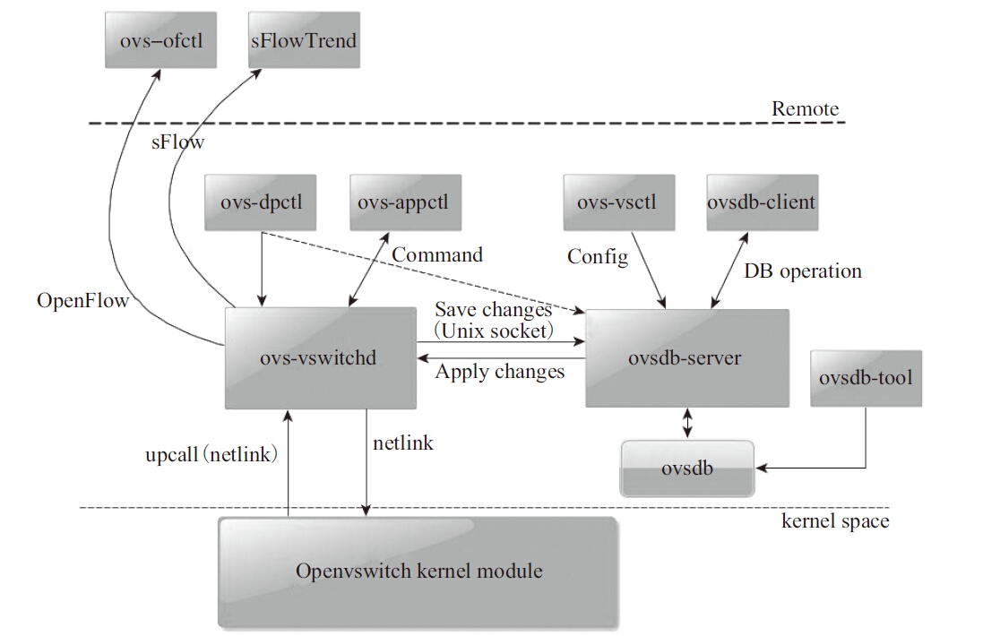
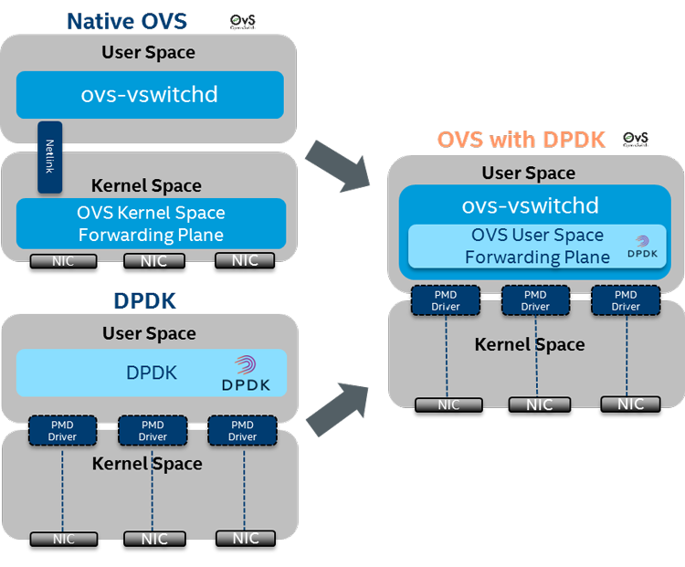

### 总体技术

DPDK可以很好的在英特尔架构下执行高性能网络数据包处理，主要使用了以下技术：

- 轮询 

  避免中断上下文切换的开销

- 用户态驱动（UIO驱动） 

  规避了不必要的内存拷贝，避免了系统调用。

- 亲和性与独占 

  DPDK工作在用户态，线程的调度依然依赖内核，利用线程的CPU亲和性绑定的方式，特定任务可以被指定只在某个核上工作

- 降低访存开销 

  如内存大页，内存多通道的交错访问，NUMA系统的使用

- 软件调优 

  内存对齐，数据预取，避免跨cache行共享

- 利用IA新硬件技术

- 充分挖掘网卡的潜能

### 安装

环境：

* virtualbox虚拟机安装debian11.3
* linux内核：5.10.127-1
* 4核4G
* 网卡：
  * 占用3个虚拟网卡，使用host-only模式
  * 虚拟网卡类型选择：“intel 82545EM”
  * 开启混杂模式“全部允许”，否则受限于程序处理性能，收包不会很多，虚拟机上很难达到较高的速率

下面介绍使用源码进行安装dpdk的方式：

```shell
# 下载dpdk: 19.11.13版本. 注意: 20.x.x以上版本编译方式改变比较大，这里我们还是使用19.x.x版本
wget https://fast.dpdk.org/rel/dpdk-19.11.13.tar.xz

# 安装依赖库
sudo apt-get install libnuma-dev libpcap-dev build-essential
# 安装何时版本的linux-headers，编译igb_uio内核模块会用到
sudo apt install linux-headers-x.x.x-x-amd64.deb linux-headers-x.x.x-x-common.deb

# 架构为64位x86linux系统, gcc编译, 开启PCAP功能. 这样会默认编译到源码目录的build目录下
make -j4 install T=x86_64-native-linuxapp-gcc DESTDIR=install
#添加抓包功能，在编译ovs-dpdk时会出错，所以这里注释掉
#sed -ri 's,(PMD_PCAP=).*,\1y,' build/.config 
#make -j 4

# 生成环境变量
export RTE_SDK=$(pwd)
export RTE_TARGET=x86_64-native-linuxapp-gcc
# 持久化到shell配置文件
echo "export RTE_SDK=$(pwd)" >> ~/.bashrc
echo "export RTE_TARGET=x86_64-native-linuxapp-gcc" >> ~/.bashrc

# 加载模块dpdk网卡驱动igb_uio
modprobe uio
mkdir -p /lib/modules/$(uname -r)/extra
cp ${RTE_SDK}/build/kmod/igb_uio.ko /lib/modules/$(uname -r)/extra/
depmod -a
modprobe igb_uio
# 设置驱动开机加载
echo "uio" >> /etc/modules
echo "igb_uio" >> /etc/modules

# 预留大页: 1024*2M=2G；写入sysctl开机生效
echo "vm.nr_hugepages=1024" >> /etc/sysctl.conf
sysctl -p
# 查看是否生效
cat /proc/meminfo | grep Huge	  # Hugetlb行表示占用了多少内存
free 							# 看到少了2G(内存足够情况下)
# 执行大页挂载给dpdk使用
mkdir -p /mnt/huge
mount -t hugetlbfs nodev /mnt/huge

# 绑定网卡
$RTE_SDK/usertools/dpdk-devbind.py -s		# 查看状态
ifconfig enp0s8 down						# 绑定前先将网卡接口关闭, 否则绑定不成功
ifconfig enp0s9 down
$RTE_SDK/usertools/dpdk-devbind.py --bind=igb_uio enp0s8
$RTE_SDK/usertools/dpdk-devbind.py --bind=igb_uio enp0s9

$RTE_SDK/usertools/dpdk-devbind.py -s		# 再次查看状态
```

当我们执行完`$RTE_SDK/usertools/dpdk-devbind.py --bind=igb_uio (网卡名称)`后, 发现网卡接口使用ifconfig查找不到了. 这是正常的, 因为网卡已经不被内核设备管理系统接管了, 而是由igb_uio驱动模块控制. 

至此，我们dpdk模块编译、安装、配置完毕。下面写两个脚本用于初始化和卸载dpdk运行环境：

初始化：

```shell
#filename: initdpdk.sh
mount -t hugetlbfs nodev /mnt/huge

ifconfig enp0s8 down
ifconfig enp0s9 down
$RTE_SDK/usertools/dpdk-devbind.py --bind=igb_uio enp0s8
$RTE_SDK/usertools/dpdk-devbind.py --bind=igb_uio enp0s9
```

卸载：

```shell
#filename: finidpdk.sh
$RTE_SDK/usertools/dpdk-devbind.py --bind=e1000 0000:00:08.0
$RTE_SDK/usertools/dpdk-devbind.py --bind=e1000 0000:00:09.0
ifconfig enp0s8 up
ifconfig enp0s9 up

unmount /mnt/huge
```


### 体验测试用例

* helloworld
  编译：

  ```shell
  cd $RTE_SDK/examples/helloworld
  make -j4
  ```

  运行：

  ```shell
  #初始化dpdk运行环境
  ./initdpdk.sh
  
  cd $RTE_SDK/examples/helloworld
#会打印出当前可用的cpu核心情况，然后退出
  ./build/app/helloworld
  ```
  
* testpmd

  这个测试程序功能比较强大, 用于测试基于dpdk的转发. 我们这里测试它最常用的一项功能: 探测当前dpdk达到的网卡转发速率. 首先上一下结构图:

  ```
  # 这是testpmd默认的处理模式
  				=================================
           --------|     <-------                   |
           |   --->|Port0----   |                   |
           |   |   |        |   |           TestPMD |
           |   ----|Port1<---   |                   |
           ------->|     --------                   |
  				=================================
  ```

  可以看到, 默认状态下, 让TestPMD绑定两个网卡, 网卡Port0进来的包会转发到Port1, 反之亦然. 这样就形成了一个环状, 可以测试发送和接收的综和速率.

  testpmd默认在dpdk编译时已经编译好了，直接运行即可，使用如下命令:

  ```shell
  # 参数说明:
  # -l 0,1,2	：使用0，1，2号cpu核心
  # -c 0x11	：使用掩码标记了1的cpu核心，与`-l`互斥
  # -n 1 		：使用的内存通道数。由于我们的NUMA只有1个，这里使用1个内存通道
  # -- 		：隔离EAL参数（在前）和testpmd参数（在后）
  # -i		：交互模式
  # --nb-cores=2	：用于数据包收发的cpu核心数
  # --nb-ports=2	：用于数据包收发的网卡端口数
  $RTE_SDK/$RTE_TARGET/app/testpmd -c -n3 -- -i --nb-cores=2 --nb-ports=2
  #首先看一下当前转发状态, 如上面所描述的, 并且两个port被分配到了两个核上
  testpmd> show config fwd
  io packet forwarding - ports=2 - cores=2 - streams=2 - NUMA support enabled, MP allocation mode: native
  Logical Core 1 (socket 0) forwards packets on 1 streams:
    RX P=0/Q=0 (socket 0) -> TX P=1/Q=0 (socket 0) peer=02:00:00:00:00:01
  Logical Core 2 (socket 0) forwards packets on 1 streams:
    RX P=1/Q=0 (socket 0) -> TX P=0/Q=0 (socket 0) peer=02:00:00:00:00:00
  
  #启动
  testpmd> start
  #查看下当前收发包情况和pps
  testpmd> show port stats all
    ######################## NIC statistics for port 0  ########################
    RX-packets: 0          RX-missed: 0          RX-bytes:  0
    RX-errors: 0
    RX-nombuf:  0         
    TX-packets: 0          TX-errors: 0          TX-bytes:  0
  
    Throughput (since last show)
    Rx-pps:            0
    Tx-pps:            0
    ############################################################################
  
    ######################## NIC statistics for port 1  ########################
    RX-packets: 0          RX-missed: 0          RX-bytes:  0
    RX-errors: 0
    RX-nombuf:  0         
    TX-packets: 0          TX-errors: 0          TX-bytes:  0
  
    Throughput (since last show)
    Rx-pps:            0
    Tx-pps:            0
    ###########################################################################
  ```

  到这里我们发现很奇怪, 不管等待多久, 都没有收发包情况! 是不是配置错了?
  不是的! 因为我们用的虚拟网卡模拟, 网络情况太纯粹了, 并不会无故收到一些广播包. 所以当前的回环处于没有数据包输入的状态. 当前面[#安装]()一节中已经提到, 这时候网卡还没有配置ip, 只是被igb_uio接管了而已. 所以我们无法定向的向这个网卡输入数据包了. 简单起见, 我们从网络上其他节点发起广播包即可. 比如我的是virtualbox虚拟机, 我直接在宿主机上使用ping指定从"vboxnet0"接口发出请求一个未arp缓存过得IP, 这时就会发起arp广播.

  ```shell
  ping -I vboxnet0 123.4.5.6
  ```

  这时再去查收发包情况, 就有数据了

  ```shell
  testpmd> show port stats all
    ######################## NIC statistics for port 0  ########################
    RX-packets: 19714996   RX-missed: 0          RX-bytes:  1375285466
    RX-errors: 0
    RX-nombuf:  0         
    TX-packets: 14238790   TX-errors: 0          TX-bytes:  854327528
  
    Throughput (since last show)
    Rx-pps:       131180
    Tx-pps:       130749
    ############################################################################
  
    ######################## NIC statistics for port 1  ########################
    RX-packets: 14238837   RX-missed: 0          RX-bytes:  854330220
    RX-errors: 0
    RX-nombuf:  0         
    TX-packets: 19714996   TX-errors: 0          TX-bytes:  1375285072
  
    Throughput (since last show)
    Rx-pps:       130720
    Tx-pps:       131176
    ############################################################################
  
  # 测试完毕, 换一种方式, 单核处理
  testpmd> stop
  testpmd> set nbcore 1
  # 看看这时转发情况集中到了一个核
  testpmd> show config fwd
  # 可以重新开始测试了
  testpmd> start
  ```

  到这里, 基础的安装验证完毕。测试结论如下：

  * nbcore=2时：
    * 不启用混杂模式，ping触发小包：30Kpps, 10Mbps
    * 启用混杂模式，ping触发小包：160Kpps，100Mbps
    * 启用混杂模式，ping触发大包（1400Bytes）：160Kpps，800Mbps~1.8Gbps
  * nbcore=1时：
    * 启用混杂模式，ping触发小包：200Kpps，140Mbps
    * 启用混杂模式，ping触发大包（1400Bytes）：200Kpps，2.3Gbps
  * 对比iperf测试：
    * 两台机器，udp协议：客户端2.3Gbps，服务端2.3Gbps

  可以看到，虚机网卡还是很难达到网卡线速。且单核情况下效率比使用双核竟然要高，可以大致推测如下原因：

  * 虚拟网卡性能存在瓶颈：其原理是将收发指令转换为CPU指令；需要使用**SR-IOV**技术直接将网卡硬件操作挂接到虚拟机
  
    ```shell
    # SR-IOV（Single Root I/O Virtualization and Sharing）是PCIe标准中引入的一个可选特性，它能够让一个物理PCIe设备（PF：Physical Function）衍生出多个虚拟PCIe设备（VF：Virtual Function），通常情况下，这些衍生出来的VF将会分配给不同的应用程序，或者虚拟机使用，达到设备共享的目的，从而最大化物理PCIe设备的利用率。
    # 一般网卡支持SRIOV，就可以分配多个VF网卡，然后将网卡直接绑定到虚拟机，提升虚拟机网卡性能。
    
    # linux下查看网卡是否开启SR-IOV
    # 首先获取到网卡设备号
    lspci -nn | grep Eth
    
    # 然后查看是否支持sr-iov
    lspci -s xxxx:xx:xx.x -vvv | grep -i sr-iov
    ```
  
  * 机器不支持NUMA架构，导致多核处理效率反而更低；需要使用NUMA

**错误总结:**

1. PCI device 0000:00:04.0 on NUMA socket -1

   这些信息在虚拟机上不用在意，好像是在kvm中才有，实体机上并没有这些错误信息，但不影响程序运行。
   收不到包是因为kvm中的网络模式错误，应该配置“桥接网卡”，“NAT”是不行的

   可以进一步探索KVM的原理.


## dpdk压测工具

### pktgen

注意pktgen版本和dpdk版本有比较强的对应关系，但这个版本对应关系官方没有具体进行说明。这里我们dpdk版本是19.11.13，则使用`pktgen-dpdk-pktgen-20.03.0.tar.xz`，才不会出现莫名其妙的编译报错。编译过程如下：

```shell
# 安装依赖
apt install pkg-config liblua5.3-dev

# 直接编译即可，使用了RTE_SDK、RTE_TARGET环境变量
cd openvswitch-2.13.9
make -j4
```

运行，使用如下命令：

```shell
#初始化dpdk运行环境
./initdpdk.sh

# 查看帮助文档
./app/x86_64-native-linuxapp-gcc/pktgen -h
#运行
./app/x86_64-native-linuxapp-gcc/pktgen -l 0-4 -n1 --proc-type auto --socket-mem 1024 -- -P -m "[1:2].0,[3:4].1"
# 开启发包，0是port的编号; 指令参考： https://pktgen-dpdk.readthedocs.io/en/latest/commands.html
pktgen> start 0
# 同样可以查看到有网络流量发出
pktgen> show port stats all
```

### dperf

dperf是百度基于dpdk开发的http压测工具，声称能进行100Gbps的网络性能与压力测试。一般场景下是使用其客户端对具体服务端做压测。

下载dperf，参考官方说明安装即可：https://github.com/baidu/dperf/blob/main/README-CN.md

```shell
#编译
cd dperf
make -j8

#绑定网卡，使用uio_pci_generic
$RTE_SDK/usertools/dpdk-devbind.py --bind=uio_pci_generic enp0s8
$RTE_SDK/usertools/dpdk-devbind.py --bind=uio_pci_generic enp0s9
```

客户端和服务端配置文件模板在`${dperf_root}/test/http`目录下，具体配置项含义可以参考文档，这边使用的客户端配置文件：

* 客户端IP：192.168.56.51
* 服务器IP:PORT ：192.168.56.50:80
* 网关：192.168.56.1

```shell
mode        client
cpu         0
duration    60s
cps         100k
port        0000:00:09.0    192.168.56.51   192.168.56.1
client      192.168.56.51   4
server      192.168.56.50   1
listen      80              1
```

运行：

```shell
#初始化dpdk运行环境
./initdpdk.sh

#运行
./build/dperf -c ./client.conf
```

在`192.168.56.50`抓包便可以看到客户端正在大量发送http请求来自`192.168.56.51`

## dpdk实现用户态协议栈

目前网上大概有4种方式:

* seastar: 使用C++14, 基于dpdk, 封装自定义的协议栈, 并向上层提供事件驱动api
* 基于FreeBsd改版: f-stack
* 基于tapip/level-ip改版: **NtyTcp**, https://github.com/wangbojing/NtyTcp
* 基于自定义协议改版: 主要是mtcp, 它自身也支持了集成dpdk; **LWIPDPDK**; 另外就是闭源的dpdk-ans(差评), 以及日本的stcp

另外, 根据对于所有用户态协议栈的了解, 它们都没有处理底层的路由和转发细节, 只能接收mac地址和ip地址都指向自己的数据包. 对于更底层的路由问题, 应该是会交给openvswitch+dpdk进行处理.


## OVS-DPDK

### 原理

#### 【普通ovs】

ovs的架构图：
[](https://img2020.cnblogs.com/blog/1060878/202105/1060878-20210509130204033-1033930936.png)

`ovs`处理流表的过程是：
1.ovs内核模块的datapath接收到从ovs连接的某个网络设备发来的数据包，从数据包中提取源/目的IP、源/目的MAC、端口等信息。
2.ovs内核模块在**内核态**查看流表结构（通过Hash），观察是否有缓存的信息可用于转发这个数据包，有则直接进行转发。
3.内核不知道如何处置这个数据包时，会将其发送给用户态的ovs-vswitchd。
4.ovs-vswitchd进程接收到upcall后，将检查ovsdb-server数据库以查询数据包的目的端口是哪里，然后告诉内核应该将数据包转发到哪个端口，例如eth0。
5.内核执行用户设置的动作将数据包发出，并将转发规则记录到缓存流表结构。

#### 【ovs-dpdk】

DPDK加速的OVS与原始OVS的区别在于，从OVS连接的某个网络端口接收到的报文不需要openvswitch.ko内核态的处理，报文通过DPDK PMD驱动直接到达用户态ovs-vswitchd里。
[](https://img2020.cnblogs.com/blog/1060878/202105/1060878-20210509130057172-1672367703.png)

`DPDK加速的OVS`数据流转发的大致流程如下：
1.OVS的ovs-vswitchd接收到从OVS连接的某个网络端口发来的数据包，从数据包中提取源/目的IP、源/目的MAC、端口等信息。
2.OVS在**用户态**查看精确流表和模糊流表，如果命中，则直接转发。
3.如果还不命中，在SDN控制器接入的情况下，经过OpenFlow协议，通告给控制器，由控制器处理。
4.控制器下发新的流表，该数据包重新发起选路，匹配；报文转发，结束。

`总结`
主要区别在于流表的处理。普通ovs流表转发在内核态，而ovs-dpdk流表转发在用户态

### 安装ovs-dpdk

ovs支持的dpdk版本，可以查看官方发版faq：https://docs.openvswitch.org/en/latest/faq/releases/

这里我们使用的版本是：

* open vswitch: 2.13.9
* dpdk：19.11.13

编译过程如下：

```shell
#下载源码
wget https://www.openvswitch.org/releases/openvswitch-2.13.9.tar.gz
tar -zxvf openvswitch-2.13.9.tar.gz

#编译；可以使用--prefix=$(pwd)/ovs指定安装到当前ovs目录下
./configure --with-dpdk=${RTE_SDK}/${RTE_TARGET}
#安装
make -j8
sudo make install

#检查安装版本是否正确，会打印dpdk版本
ovs-vswitchd --version
ovs-vsctl get Open_vSwitch . dpdk_initialized

#ovs初始化数据库，只需要在安装后运行一次即可
mkdir -p /usr/local/etc/openvswitch
mkdir -p /usr/local/var/run/openvswitch
ovsdb-tool create /usr/local/etc/openvswitch/conf.db vswitchd/vswitch.ovsschema
mkdir -p /usr/local/var/log/openvswitch
ovs-vsctl --no-wait init
```

启动、运行ovs：

```shell
#启动脚本：startovs.sh
ovsdb-server --remote=punix:/usr/local/var/run/openvswitch/db.sock --remote=db:Open_vSwitch,Open_vSwitch,manager_options --private-key=db:Open_vSwitch,SSL,private_key --certificate=db:Open_vSwitch,SSL,certificate --bootstrap-ca-cert=db:Open_vSwitch,SSL,ca_cert  --pidfile --detach --log-file

export PATH=$PATH:/usr/local/share/openvswitch/scripts
export DB_SOCK=/usr/local/var/run/openvswitch/db.sock
ovs-vsctl --no-wait set Open_vSwitch . other_config:dpdk-init=true
ovs-ctl --no-ovsdb-server --db-sock="$DB_SOCK" start
```

创建网桥br0，并绑定DPDK端口

```shell
ovs-vsctl add-br br0 -- set bridge br0 datapath_type=netdev
ovs-vsctl add-port br0 myportnameone -- set Interface myportnameone type=dpdk options:dpdk-devargs=0000:00:09.0
```

关停ovs：

```shell
export PATH=$PATH:/usr/local/share/openvswitch/scripts
ovs-ctl --no-ovsdb-server stop
ovs-ctl --no-ovs-vswitchd stop
pkill -x ovsdb-server
```

