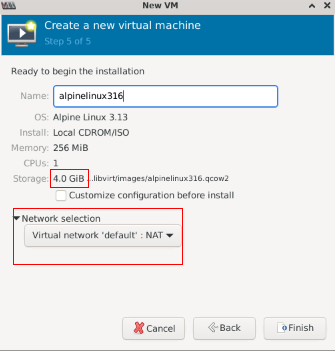

## 无法使用docker运行ovs

经过长时间尝试, 使用docker无法实现不同命名空间中运行ovs, 主要尝试和卡点如下:

* 容器网络选择: 使用bridge

* 两个容器构造不同网段: 使用`--net`指定不同网络

  ```shell
  docker network create net2
  docker run -tid --name=c1 --privileged debian:ovs /bin/bash
  docker run -tid --name=c2 --privileged --net net2 debian:ovs /bin/bash
  ```

* 两个容器间互ping: 经过宿主机, 宿主机直接添加防火墙规则:

  ```shell
  iptables -t filter -I FORWARD -j ACCEPT
  ```

* 容器启动ovs-vswitchd失败: 内核模块需要在宿主机上加载:

  ```shell
  modprobe openvswitch
  modprobe tun
  ```

* 进入容器, 初始化ovs:

  ```shell
  service openvswitch-switch stop
  rm -rf /etc/openvswitch/*
  service openvswitch-switch start
  ovs-vsctl emer-reset
  ovs-vsctl init
  
  ovs-vsctl add-br br0
  ovs-vsctl set bridge br0 fail-mode=standalone
  ip l s br0 up
  ip a a 192.168.1.3/24 dev br0
  ovs-vsctl add-port br0 gre0 -- set interface gre0 type=gre options:remote_ip=172.17.0.2
  ```

* 发现br0内收到gre包, 并且正确解包出arp, arp包通过gre_sys能收到, 但是无法进一步按流表广播给br0; 这应该是和ovs内部实现的gre_sys处理有关, 没有做到完全的命名空间隔离, 导致解出来的arp包无法匹配到任何流表, 直接被丢弃
  查看当时的log: `vi /var/log/openvswitch/ovs-vswitchd.log`, 有如下错误:

  > ```
  > |WARN|receive tunnel port not found
  > |INFO|received packet on unassociated datapath port 2
  > ```

  这其实是因为ovs还未支持命名空间完全隔离导致，经查询，ovs-daemon会运行在父命名空间，监听所有的子命名空间netlink消息，验证这一猜想：https://docs.openvswitch.org/en/latest/topics/networking-namespaces/#open-vswitch-networking-namespaces-on-linux。

  官方对于docker容器化支持, 也只是需要使用`-net=host`模式, 使用不同命名: https://docs.openvswitch.org/en/latest/intro/install/general/#starting-ovs-in-container。
  
  实际**`mininet`也是这么做的**，并没有将ovs放到不同的容器中运行，而是多个容器在宿主机运行并使用不同的命名。

## 使用docker运行cc

服务依赖：

```shell
cc:
	redis-cluster-init: 用于3个redis节点跑起来后对集群进行初始化
		redis-1
		redis-2
		redis-3
	ck-cluster-init: 用于再clickhouse服务器运行起来后执行初始化
	# 初始化数据表和添加初始数据：
	# clickhouse-client --host 127.0.0.1 --port 9011 --password xxx --multiquery < /etc/clickhouse-server/init.sql
		ck-server-1
```


## 使用vagrant+kvm运行ap

PS: 使用vagrant+virtualbox理论上也可以, 但是因为linux上支持virtualbox虚拟化时内部应该有bug, 导致虚机运行一段时间后出现虚拟内存错误, 直接导致应用程序崩溃, 所以改用"vagrant+kvm"

### 安装环境:

首先, 我们的虚机要开启嵌套虚拟化, 检查是否支持:

```shell
sudo lscpu | grep Virtualization
```

安装kvm环境: 参见[system/qemu虚拟机安装.md]()

```shell
sudo apt install qemu-kvm libvirt-daemon-system libvirt-clients bridge-utils virtinst virt-manager
sudo usermod -aG libvirt $USER
sudo usermod -aG kvm $USER
```

安装vagrant程序: 参考[官网](https://www.vagrantup.com/downloads)下载最新版本, 然后再离线环境下安装

```shell
#在线环境下下载
wget -O- https://apt.releases.hashicorp.com/gpg | gpg --dearmor | sudo tee /usr/share/keyrings/hashicorp-archive-keyring.gpg
echo "deb [signed-by=/usr/share/keyrings/hashicorp-archive-keyring.gpg] https://apt.releases.hashicorp.com $(lsb_release -cs) main" | sudo tee /etc/apt/sources.list.d/hashicorp.list
sudo apt update && sudo apt download vagrant

#离线环境下安装
sudo dpkg -i ./vagrant_xxx.deb
```

安装vagrant-libvirt插件: 由于是离线环境下安装, 需要在在线环境下安装好`vagrant-libvirt`之后, 再使用bundle导出; 然后在离线环境下安装好:

```shell
#在线环境下安装
gem install vagrant-libvirt
#导出gem包及相关依赖包, bundle输出到./vender/cache/目录下
gem insatll bundle
bundle cache --no-install

#离线安装
#1.先安装依赖
apt install libvirt-dev build-essential make autoconf
#2.由于gem编译依赖libvirt-dev安装路径, 有些情况下会找不到, 这里直接指定
CONFIGURE_ARGS='with-libvirt-include=/usr/include/libvirt with-libvirt-lib=/usr/lib' gem install --local ./*.gem
```

最后配置下环境变量, `vi ~/.bashrc`

```shell
...
export LIBVIRT_DEFAULT_URI="qemu:///system"
export VAGRANT_DEFAULT_PROVIDER=libvirt
```


### 制作vagrant box

接下来我们来制作vagrant box. 我们新建一个kvm虚拟机, 为了方便起见, 直接使用`virtual machine manager`图形化界面创建即可, 这样也方便后续调试排错:

1. 新建虚拟机, 按提示找到alpine的iso镜像文件, 以及创建磁盘, 指定网卡等操作, 就不一一说明了, 具体看相关文档即可
   

   

2. 启动, 输入`root`用户直接登录, 再输入`setup-alpine`安装alpine316, 具体安装细节参考[官网](https://docs.alpinelinux.org/user-handbook/0.1a/Installing/setup_alpine.html). 

3. 安装完毕, 做额外配置, 确保:

   * 配置ssh允许root登录: `vi /etc/ssh/sshd_config`

     ```shell
     ...
     PermitRootLogin yes
     ...
     ```

     之后, 重新加载配置文件: `/etc/init.d/sshd reload`

     后面的操作可以使用root用户ssh登录该虚机, 方便拷贝执行下面的命令

   * 安装必要的软件包:

     ```shell
     echo "https://mirrors.aliyun.com/alpine/v3.15/main" > /etc/apk/repositories
     echo "https://mirrors.aliyun.com/alpine/v3.15/community" >> /etc/apk/repositories
     apk update
     apk add --no-cache bash grep sudo ifupdown-ng libc6-compat
     ```

   * 配置vagrant用户: 如果没有配置vagrant用户, 需要配置

     ```shell
     adduser --home /home/vagrant --shell /bin/bash vagrant
     ```

   * 配置sudo, 允许vagrant直接访问, `vi /etc/sudoers`

     ```shell
     ...
     vagrant ALL=(ALL:ALL) NOPASSWD:ALL
     ...
     ```

   * 添加vagrant用户ssh免密登录:

     ```shell
     mkdir /home/vagrant/.ssh
     wget http://github.com/mitchellh/vagrant/raw/master/keys/vagrant.pub -O /home/vagrant/.ssh/authorized_keys
     chmod 0600 /home/vagrant/.ssh/authorized_keys
     chown vagrant:vagrant /home/vagrant/.ssh/authorized_keys
     ```

   * 安装项目需要的软件包, 后续可以自行补充其他软件包

     ```shell
     apk add --no-cache openvswitch libreswan tcpdump netcat-openbsd
     #配置服务自启动
     rc-update add ovs-modules
     rc-update add ovsdb-server
     rc-update add ovs-vswitchd
     rc-service ovs-modules start
     rc-service ovsdb-server start
     rc-service ovs-vswitchd start
     ```

   * 整理磁盘碎片, 为压缩镜像做准备:

     ```shell
     dd if=/dev/zero of=/NULL bs=8M
     rm -rf /NULL
     ```

4. 配置完毕, 关机.

5. 在`/var/lib/libvirt/images/alpinelinux316.qcow2`找到了kvm虚机的镜像, 它占用空间比较大, 我们需要压缩, 前面做的整理磁盘碎片就是为了更好压缩体积:

   ```shell
   qemu-img convert -c -O qcow2 alpinelinux316.qcow2 new.qcow2
   ```

6. 压缩完毕, qcow2文件小了很多, 接下来我们构建"*.box"文件:

   ```shell
   # 改名: vagrant libvirt认定镜像为这个名字
   mv new.qcow2 box.img
   
   # 创建metadata.json文件
   cat > ./metadata.json << EOF
   {
       "provider"     : "libvirt",
       "format"       : "qcow2",
       "virtual_size" : 40
   }
   EOF
   
   # 创建Vagrantfile文件
   cat > ./Vagrantfile << EOF
   Vagrant.configure("2") do |config|
     config.vm.provider :libvirt do |libvirt|
       libvirt.driver = "kvm"
     end
   end
   EOF
   
   # 构建box文件
   tar cvzf alpine316.box ./metadata.json ./Vagrantfile ./box.img
   ```

   至此, 我们自制的alpine316.box完成

### 运行alpine316.box

首先, 导入我们的alpine316.box, 并作些前置依赖配置

```shell
#导入
vagrant box add -f alpine316.box --name "alpine316" --provider libvirt

#生成ssh key, 下文Vagrantfile会用到. 一路回车即可
ssh-keygen
```

然后, 本地编写Vagrantfile:

```ruby
Vagrant.configure("2") do |config|
  config.vm.box = "xxmygw/alpine316"
  config.vm.provider "libvirt" do |vb|
    #vb.gui = true
    vb.qemu_use_session = false
    vb.cpus = 2
    vb.memory = 256
    vb.driver = "kvm"
    vb.nic_model_type = "e1000"
  end

  #配置host-only网络, 如果这个网段的主机网络在 VirtualBox 中不存在，
  #Vagrant 会在启动虚机时自动创建
  config.vm.network "private_network", ip: "192.168.1.101"
  #config.vm.network "private_network", type: "dhcp"

  config.ssh.insert_key = false
  config.ssh.private_key_path = ["~/.ssh/id_rsa", "~/.vagrant.d/insecure_private_key"]
  config.vm.provision "file", source: "~/.ssh/id_rsa.pub", destination: "~/.ssh/authorized_keys"
  config.ssh.username = "root"
  config.ssh.password = "root"
  config.vm.synced_folder '.', '/vagrant', disabled: true

  #端口映射: 注意默认的2222->22端口规则无法修改, 只能显示disable
  # config.vm.network "forwarded_port", guest: 22, host: 2222, id: "ssh", disabled: "true"

  #provision用于vagrant自动执行构建任务. 执行时机:
  #     某个环境初次执行 vagrant up 的时候
  #     执行 vagrant provision 命令
  #     重启的时候 vagrant reload --provision，带上 --provision 选项
  #config.vm.provision "shell", inline: <<-SHELL
  #  echo "https://mirrors.aliyun.com/alpine/v3.15/main" > /etc/apk/repositories
  #  echo "https://mirrors.aliyun.com/alpine/v3.15/community" >> /etc/apk/repositories
  #  apk update
  #  apk add openvswitch libreswan netcat-openbsd ifupdown-ng tcpdump libc6-compat
  #  rc-update add ovs-modules
  #  rc-update add ovsdb-server
  #  rc-update add ovs-vswitchd
  #  rc-service ovs-modules start
  #  rc-service ovsdb-server start
  #  rc-service ovs-vswitchd start
  #SHELL
end
```

使用Vagrant启动kvm虚拟机:

```shell
#启动虚拟机;
#加--no-destroy-on-error选项代表失败时不自动删除kvm虚机, 这样可以在virt-manager或virsh中登录kvm虚拟机调试发现具体问题
vagrant up --no-destroy-on-error
#打更多日志发现问题
VAGRANT_LOG=debug vagrant up --no-destroy-on-error

#重启更新配置:
vagrant reload --provision

#销毁虚拟机
vagrant destroy -f
```

虚拟机启动后, 就可以尽情玩耍了

### 问题排除记录

1. vagrant up报错:

   ```shell
   ==> alpine-vm: Configuring and enabling network interfaces...
   ==> alpine-vm: Removing domain...
   The following SSH command responded with a non-zero exit status.
   Vagrant assumes that this means the command failed!
   
   /sbin/ifdown eth1 2> /dev/null
   
   Stdout from the command:
   
   
   
   Stderr from the command:
   ```

   解决: 原因是vagrant2.2.14左右的版本, 在识别alpine中新版ifup/ifdown指令的输出时判断有误, 导致对于正确的情况直接误判为异常并终止虚机; 升级到vagrant2.3.0就工作正常了
   
2. 如果`vagrant destroy -f`时报错"xxx domain about to create is already token"
   主要是没有将虚拟机删除，这里使用virsh进行删除即可：

   ```shell
   virsh list --all
   virsh shutdown run_ap1
   virsh undefine run_ap1
   ```

   
3. `vagrant destroy -f`时报错"xxx domain about to create is already token"
   主要是没有将虚拟机删除，这里使用virsh进行删除即可：

   ```shell
   virsh list --all
   virsh shutdown run_ap1
   virsh undefine run_ap1
   ```

   
