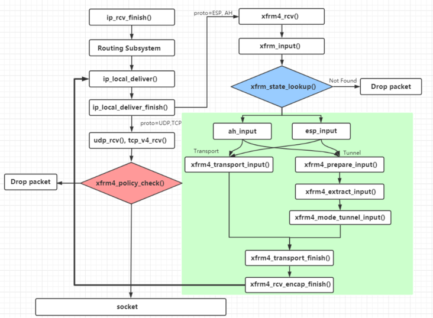
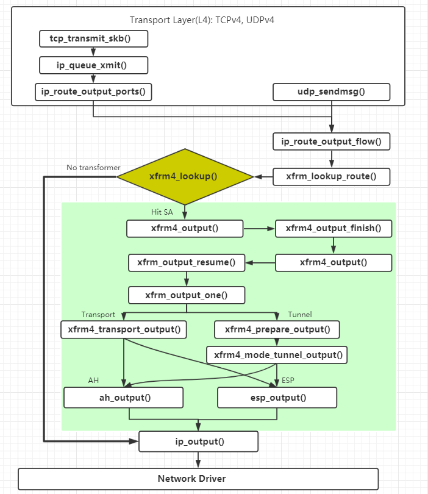

## 搭建

连接方式:

* ap1作为服务端, 被动接收ap2和ap3的连接. ap1使用同一张ipsec0网卡接收数据包
* ap2, ap3作为客户端

故障定位和排除, 参考: [Chapter 4. Configuring a VPN with IPsec Red Hat Enterprise Linux 8 | Red Hat Customer Portal](https://access.redhat.com/documentation/en-us/red_hat_enterprise_linux/8/html/securing_networks/configuring-a-vpn-with-ipsec_securing-networks)

配置文件如下:

ipsec.secrets: 初期使用预共享密钥方式, 后续可以改为rsa非对称加密

```shell
## 源ip 目的ip : PSK "key" (0.0.0.0 所有ip)
0.0.0.0  0.0.0.0 : PSK "1234567890111111"
```

ap1/ipsec.conf

```shell
config setup
	logfile=/var/log/pluto.log
	virtual_private=%v4:240.0.0.0/8

conn 1to2
	# 指定认证类型为预共享秘钥
	authby=secret
	encapsulation=yes
	# 指定模式类型为隧道模式
	type=tunnel
	# ipsec启动时自动启动隧道
	auto=start
	# 第一阶段强制使用ikev2模式
	ikev2=insist
	ike=aes256-sha2
	ikelifetime=86400
	#第二阶段选择esp加密方式, 加密算法为aes_gcm128, 认证算法null
	phase2=esp
	phase2alg=aes_gcm128-null
	#开启VTI功能, 系统生成名为ipsec0的接口, 并配置rightsubnet路由到接口上
	mark=20/0xffffffff
	vti-interface=ipsec0
	vti-shared=yes
	vti-routing=yes

	left=192.168.1.10
	leftsubnet=240.0.0.1/32
	leftid=@1
	#leftnexthop=%defaultroute

	#作为服务端, 接受ipsec客户端连接; 由于对端是ADSL动态IP的环境, 可以设置right为%any
	right=%any
	rightsubnet=240.0.0.2/32
	rightid=@2
	#rightnexthop=%defaultroute

conn 1to3
	# 指定认证类型为预共享秘钥
	authby=secret
	encapsulation=yes
	# 指定模式类型为隧道模式
	type=tunnel
	# ipsec启动时自动启动隧道
	auto=start
	# 第一阶段强制使用ikev2模式
	ikev2=insist
	ike=aes256-sha2
	ikelifetime=86400
	#第二阶段选择esp加密方式, 加密算法为aes_gcm128, 认证算法null
	phase2=esp
	phase2alg=aes_gcm128-null
	#开启VTI功能, 系统生成名为ipsec0的接口, 并配置rightsubnet路由到接口上
	mark=20/0xffffffff
	vti-interface=ipsec0
	vti-shared=yes
	vti-routing=yes
	
	#开启VTI功能
	#mark=2/0xffffffff
	#vti-interface=ipsec0
	#vti-shared=yes
	vti-routing=yes

	left=192.168.1.10
	leftsubnet=240.0.0.1/32
	leftid=@1
	#leftnexthop=%defaultroute

	right=%any
	rightsubnet=240.0.0.3/32
	rightid=@3
	#rightnexthop=%defaultroute

```

ap2/ipsec.conf

```shell
config setup
	logfile=/var/log/pluto.log
	virtual_private=%v4:240.0.0.0/8

conn 2to1
	# 指定认证类型预共享秘钥
	authby=secret
	# 指定ike算法为3des-sha1
	ike=aes256-sha2
	ikelifetime=86400
	# 指定ike
	ikev2=insist

	### phase 2 ###
	phase2=esp
	phase2alg=aes_gcm128-null
	# 指定是否压缩
	#compress=no
	# 指定是否加密
	#pfs=yes
	# 指定连接添加类型。start 为开机自启，add为添加 不主动连接
	auto=start
	# 指定模式类型为隧道模式|传输模ZZ式
	type=tunnel
	encapsulation=yes
	
	#开启VTI功能
	mark=20/0xffffffff
	vti-interface=ipsec0
	vti-shared=yes
	vti-routing=yes

	left=192.168.2.10
	leftsubnet=240.0.0.2/32
	leftid=@2
	#leftnexthop=%defaultroute

	right=192.168.1.10
	rightsubnet=240.0.0.1/32
	rightid=@1
	#rightnexthop=%defaultroute


```

ap3/ipsec.conf

```shell
config setup
	logfile=/var/log/pluto.log
	virtual_private=%v4:240.0.0.0/8

conn 3to1
	# 指定认证类型预共享秘钥
	authby=secret
	# 指定ike算法为3des-sha1
	ike=aes256-sha2
	ikelifetime=86400
	# 指定ike
	ikev2=insist

	### phase 2 ###
	phase2=esp
	phase2alg=aes_gcm128-null
	# 指定是否压缩
	#compress=no
	# 指定是否加密
	#pfs=yes
	# 指定连接添加类型。start 为开机自启，add为添加 不主动连接
	auto=start
	# 指定模式类型为隧道模式|传输模ZZ式
	type=tunnel
	encapsulation=yes
	
	#开启VTI功能
	mark=20/0xffffffff
	vti-interface=ipsec0
	vti-shared=yes
	vti-routing=yes

	left=192.168.3.10
	leftsubnet=240.0.0.3/32
	leftid=@3
	#leftnexthop=%defaultroute

	right=192.168.1.10
	rightsubnet=240.0.0.1/32
	rightid=@1
	#rightnexthop=%defaultroute


```


## 问题与解决：

1. Q：ipsec封装后超过wan口MTU的大包发出，会被拆分为两个包，经过ADSL网络，会出现较大丢包20%~50%。抓包分析发现数据包能在wan口发出，但对端随机没收到（有时收不到第一个包，有时收不到第二个）
   A：猜测是网络中识别到了拆包后的ipsec数据包（ESP协议包）不完整，做了随机丢弃。解决方式是在ovs的gre口发出，到wan口发出过程中任意环节控制发出包的大小，可选方案：

   * 【优！】实测发现小包不会丢，那么就使用vti网卡，对vti配置MTU小于一定数值，比如mtu=1400；问题解决
   * 【优！】新版支持ipsec-interface参数，也能解决同样的问题，参考：[Route-based XFRMi](https://libreswan.org/wiki/Route-based_XFRMi)
   * 【差！】使用ESPoverTCP，让ipsec底层跑在tcp协议上：[TCP support for IKEv2 and ESP](https://libreswan.org/wiki/RFC_8229_-_TCP_support_for_IKEv2_and_ESP)。需要linux5.6以上内核支持
   * 【差！】不使用ovs的内部gre，而是用ipgre创建系统可见的虚拟网口t0，手动添加到ovs；注意ovs创建的网桥br0要使用netdev模式：经检验可以通过修改t0的MTU，控制发出数据包的大小

   


## 原理

> 引自: https://segmentfault.com/a/1190000020412259
>
> h3c:IPSec VPN基本原理: http://www.h3c.com/cn/d_201005/675214_97665_0.htm
>
> 抓包讲解: https://cshihong.github.io/2019/04/03/IPSec-VPN%E4%B9%8BIKE%E5%8D%8F%E8%AE%AE%E8%AF%A6%E8%A7%A3/

### XFRM 实例

IPsec中有两个重要概念：安全关联(Security Association)和安全策略(Security Policy)，这两类信息都需要存放在内核`XFRM`。核`XFRM`使用`netns_xfrm`这个结构来组织这些信息，它也被称为xfrm instance(实例)。从它的名字也可以看出来，这个实例是与network namespace相关的，每个命名空间都有这样的一个实例，实例间彼此独立。所以同一台主机上的不同容器可以互不干扰地使用`XFRM`

```c
struct net
{
    ......
   #ifdef CONFIG_XFRM
    struct netns_xfrm    xfrm;
    #endif 
    ......
}
```

### Netlink 通道

上面提到了Security Association和Security Policy信息，这些信息一般是由用户态IPsec进程(eg. *StrongSwan*)下发到内核`XFRM`的，这个下发的通道在network namespace初始化时创建。

```c
static int __net_init xfrm_user_net_init(struct net *net)
{
    struct sock *nlsk;
    struct netlink_kernel_cfg cfg = {
        .groups    = XFRMNLGRP_MAX,
        .input    = xfrm_netlink_rcv,
    };

    nlsk = netlink_kernel_create(net, NETLINK_XFRM, &cfg);
    ......
    return 0;
}
```

这样，当用户下发IPsec配置时，内核便可以调用 *xfrm_netlink_rcv()* 来接收

### XFRM State

`XFRM`使用`xfrm_state`表示IPsec协议栈中的Security Association，它表示了一条单方向的IPsec流量所需的一切信息，包括模式(Transport或Tunnel)、密钥、replay参数等信息。用户态IPsec进程通过发送一个XFRM_MSG_NEWSA请求，可以让`XFRM`创建一个`xfrm_state`结构

`xfrm_state`包含的字段很多，这里就不贴了，仅仅列出其中最重要的字段：

- id: 它是一个`xfrm_id`结构，包含该SA的目的地址、SPI、和协议(AH/ESP)
- props：表示该SA的其他属性，包括IPsec Mode(Transport/Tunnel)、源地址等信息

每个`xfrm_state`在内核中会加入多个哈希表，因此，内核可以从多个特征查找到同一个个SA：

- xfrm_state_lookup()： 通过指定的SPI信息查找SA
- xfrm_state_lookup_byaddr(): 通过源地址查找SA
- xfrm_state_find(): 通过目的地址查找SA

用户可以通过`ip xfrm state ls`命令列出当前主机上的`xfrm_state`

```shell
src 192.168.0.1 dst 192.168.0.2
    proto esp spi 0xc420a5ed(3290473965) reqid 1(0x00000001) mode tunnel
    replay-window 0 seq 0x00000000 flag af-unspec (0x00100000)
    auth-trunc hmac(sha256) 0xa65e95de83369bd9f3be3afafc5c363ea5e5e3e12c3017837a7b9dd40fe1901f (256 bits) 128
    enc cbc(aes) 0x61cd9e16bb8c1d9757852ce1ff46791f (128 bits)
    anti-replay context: seq 0x0, oseq 0x1, bitmap 0x00000000
    lifetime config:
      limit: soft (INF)(bytes), hard (INF)(bytes)
      limit: soft (INF)(packets), hard (INF)(packets)
      expire add: soft 1004(sec), hard 1200(sec)
      expire use: soft 0(sec), hard 0(sec)
    lifetime current:
      84(bytes), 1(packets)
      add 2019-09-02 10:25:39 use 2019-09-02 10:25:39
    stats:
      replay-window 0 replay 0 failed 0
```

### XFRM Policy

`XFRM`使用`xfrm_policy`表示IPsec协议栈中的Security Policy，用户通过下发这样的规则，可以让`XFRM`允许或者禁止某些特征的流的发送和接收。用户态IPsec进程通过发送一个XFRM_MSG_POLICY请求，可以让`XFRM`创建一个`xfrm_state`结构

```gauss
struct xfrm_policy {
    ......
    struct hlist_node    bydst;
    struct hlist_node    byidx;

    /* This lock only affects elements except for entry. */
    rwlock_t        lock;
    atomic_t        refcnt;
    struct timer_list    timer;

    struct flow_cache_object flo;
    atomic_t        genid;
    u32            priority;
    u32            index;
    struct xfrm_mark    mark;
    struct xfrm_selector    selector;
    struct xfrm_lifetime_cfg lft;
    struct xfrm_lifetime_cur curlft;
    struct xfrm_policy_walk_entry walk;
    struct xfrm_policy_queue polq;
    u8            type;
    u8            action;
    u8            flags;
    u8            xfrm_nr;
    u16            family;
    struct xfrm_sec_ctx    *security;
    struct xfrm_tmpl           xfrm_vec[XFRM_MAX_DEPTH];
    struct rcu_head        rcu;
};
```

这个结构的字段很多，但大部分并不用关心，我们重点关注下面列举出的这几个字段就行：

- selector：表示该Policy匹配的流的特征
- action：取值为XFRM_POLICY_ALLOW(0)或XFRM_POLICY_BLOCK(1)，前者表示允许该流量，后者表示不允许。
- xfrm_nr: 表示与这条Policy关联的template的数量，template可以理解为`xfrm_state`的简化版本，xfrm_nr决定了流量进行**转换**的次数，通常这个值为1
- xfrm_vec: 表示与这条Policy关联的template，数组的每个元素是`xfrm_tmpl`, 一个`xfrm_tmpl`可以还原(resolve)成一个完成`state`

与`xfrm_state`类似，用户可以通过`ip xfrm policy ls`命令列出当前主机上的`xfrm_policy`

```shell
src 10.1.0.0/16 dst 10.2.0.0/16 uid 0
    dir out action allow index 5025 priority 383615 ptype main share any flag  (0x00000000)
    lifetime config:
      limit: soft (INF)(bytes), hard (INF)(bytes)
      limit: soft (INF)(packets), hard (INF)(packets)
      expire add: soft 0(sec), hard 0(sec)
      expire use: soft 0(sec), hard 0(sec)
    lifetime current:
      0(bytes), 0(packets)
      add 2019-09-02 10:25:39 use 2019-09-02 10:25:39
    tmpl src 192.168.0.1 dst 192.168.0.2
        proto esp spi 0xc420a5ed(3290473965) reqid 1(0x00000001) mode tunnel
        level required share any 
        enc-mask ffffffff auth-mask ffffffff comp-mask ffffffff
```

## 接收发送IPsec报文

### 接收

下图展示了`XFRM`框架接收IPsec报文的流程：



从整体上看，IPsec报文的接收是一个**迂回**的过程，IP层接收时，根据报文的protocol字段，如果它是IPsec类型(AH、ESP)，则会进入`XFRM`框架进行接收，在此过程里，比较重要的过程是`xfrm_state_lookup()`, 该函数查找SA，如果找到之后，再根据不同的协议和模式进入不同的处理过程，最终，将原始报文的信息获取出来，重入`ip_local_deliver()`.然后，还需经历XFRM Policy的过滤，最后再上送到应用层。

### 发送

下图展示了`XFRM`框架发送IPsec报文的流程：



```
XFRM`在报文路由查找后查找是否有满足条件的SA，如果没有，则直接走`ip_output()`,否则进入`XFRM`的处理过程，根据模式和协议做相应处理，最后殊途同归到`ip_output()
```


## ikev2穿越NAT设备

=>TODO: 必要时再深入源码层面, 其中涉及的设计和算法比较多


## REF

- Linux Kernel Networing Implementation and Throry