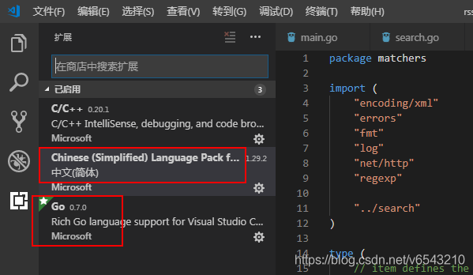

## 离线包自动安装

## 手动安装体验

### 下载安装vscode

国内下载vscode需要加速:

* 首先访问 https://code.visualstudio.com/ 点击下载对应平台vscode, 获得下载连接

* 暂停下载, 复制下载连接, 将域名替换为"vscode.cdn.azure.cn", 重新发起下载链接, 如:
  
  > https://vscode.cdn.azure.cn/stable/30d9c6cd9483b2cc586687151bcbcd635f373630/VSCodeUserSetup-x64-1.68.1.exe

* 本次下载速度就会加快很多

### 配置C/C++调试

注意:

* 指定调试要执行的程序, 需要指定完整的路径, 如: `${workspaceFolder}/python`
* 如果程序依赖的动态库在当前目录下, 需要配置环境变量`LD_LIBRARY_PATH`. 如:

```json
{
    // 使用 IntelliSense 了解相关属性。 
    // 悬停以查看现有属性的描述。
    // 欲了解更多信息，请访问: https://go.microsoft.com/fwlink/?linkid=830387
    "version": "0.2.0",
    "configurations": [
        {
            "name": "(gdb) 启动",
            "type": "cppdbg",
            "request": "launch",
            "program": "${workspaceFolder}/python",
            "args": [],
            "stopAtEntry": false,
            "cwd": "${fileDirname}",
            "environment": [{
                "name": "LD_LIBRARY_PATH",
                "value": "${workspaceFolder}"
            }],
            "externalConsole": false,
            "MIMode": "gdb",
            "setupCommands": [
                {
                    "description": "为 gdb 启用整齐打印",
                    "text": "-enable-pretty-printing",
                    "ignoreFailures": true
                },
                {
                    "description": "将反汇编风格设置为 Intel",
                    "text": "-gdb-set disassembly-flavor intel",
                    "ignoreFailures": true
                }
            ]
        }
    ]
}
```

### 配置golang调试

1. 安装`go`插件
   
2. 打开一个go文件, vscode会自动提示安装gopls等相关依赖以支持调试, 一一安装即可愉快玩耍了.

### 配置py与c++混合调试

python的c/c++扩展编译依赖CPython，以及gcc/g++，先安装：

```shell
sudo apt install libpython3.9-dev gcc g++ -y
```

示例c++扩展代码`myadd.cpp`：封装C函数`myadd`提供到python层函数

```c
#include <Python.h>

int myadd(int x, int y) {
	return x+y;
}

//1.导出函数封装：在Python的C语言扩展中，所有的导出函数都具有相同的函数原型:
// PyObject* wrap_method(PyObject* self, PyObject* args);
// 一般以wrap_开头后面跟上C语言的函数名，这样命名把导出函数和C语言函数对应起来使得代码更加清晰。
// - 参数self : 只在C函数被实现为内联方法(built-in method)时才被用到，通常该参数的值为空(NULL)。
// - 参数args : 中包含了Python解释器要传递给C函数的所有参数，通常使用Python的C语言扩展接口提供的函数PyArg_ParseTuple()来获得这些参数值。
// - 返回值 : 所有的导出函数都返回一个PyObject指针，如果对应的C函数没有真正的返回值(即返回值类型为void)，则应返回一个全局的None对象(Py_None)，并将其引用计数增1，如：
//     PyObject* wrap_method(PyObject *self, PyObject *args)
// 	   {
// 	     Py_INCREF(Py_None);
// 	     return Py_None;
// 	   }
static PyObject *wrap_myadd(PyObject *self, PyObject *args){
    int x, y, z = -1;

    /* Parse arguments */
    if(!PyArg_ParseTuple(args, "ii", &x, &y)){
            return NULL;
    }

    /* The actual bit of code I need */
    z = myadd(x, y);

    return PyLong_FromLong(z);
}

//2.导出方法列表：方法列表中列出了所有可以被Python解释器使用的方法。每项格式为：
// {方法名, 导出函数, 参数传递方式, 方法描述}
// 其中“参数传递方式”可选：
//   - METH_VARARGS		通过Python的元组方式传参
//   - METH_KEYWORDS	通过Python的字典方式传参
static PyMethodDef myaddMethods[] = {
    {"myadd", wrap_myadd, METH_VARARGS, "Python interface for myadd C library function"},
    {NULL, NULL, 0, NULL}
};

//3.模块定义结构：包含导出方法列表，用于传递给解释器的模块初始化函数
static struct PyModuleDef myaddmodule = {
    PyModuleDef_HEAD_INIT,
    "myadd",
    "Python interface for the myadd C library function",
    -1,
    myaddMethods
};

//4.模块初始化函数：初始化函数必须命名为 PyInit_name() ，其中 name 是模块的名字，并应该定义为非 static ，且在模块文件里
// PyMODINIT_FUNC 将函数声明为 PyObject * 返回类型，声明了任何平台所要求的特殊链接声明，并针对 C++ 将函数声明为 extern "C"
// 步骤3、4是py3中的格式，py2中则使用 initname() 命名函数
PyMODINIT_FUNC PyInit_myadd(void) {
    return PyModule_Create(&myaddmodule);
}
```

编译扩展：首先，编写setup.py使用distutils来构建

```shell
from distutils.core import setup, Extension

setup(name="myadd",
    version="1.0.0",
    description="Python interface for the myadd C library function",
    ext_modules=[Extension("myadd", ["myadd.cpp"])],
    )
```

然后执行编译指令：

```shell
# --inplace表示在源码处生成pyd文件或so文件
python3 setup.py build_ext --inplace
```

然后编写python调用代码`myscript.py`：

```python
import myadd

print("going to ADD SOME NUMBERS")
x = myadd.myadd(5,6)
print(x)
```

xcode调试配置：创建`.vscode`，并写入`settings.json`

```shell
{
    "python.pythonPath": "/usr/bin/python3"
}
```

然后写入调试配置文件`launch.json`

```shell
{
    "version": "0.2.0",
    "configurations": [
        {
            "name": "Python: Current File",
            "type": "python",
            "request": "launch",
            "program": "myscript.py",
            "console": "integratedTerminal"
        },
        {
            "name": "(gdb) Attach",
            "type": "cppdbg",
            "request": "attach",
            "program": "/usr/bin/python3",
            "processId": "${command:pickProcess}",
            "MIMode": "gdb",
            "setupCommands": [
                {
                    "description": "Enable pretty-printing for gdb",
                    "text": "-enable-pretty-printing",
                    "ignoreFailures": true
                }
            ]
        }
    ]
}
```

至此，我们的demo开发完毕，目录结构如下（使用vscode远程连接linux虚拟机）：


下面进行调试实操：

1. 打断点，并运行python程序调试器：
   

   

2. python程序调试器运行后，停在python脚本层断点处，还没运行c/c++代码。此时我们再来设置gdb调试器，使用attach模式连接到python3进程中

   

   点击运行按钮，会跳出选择attach进程，输入"python3"，注意这里启动的python3进程有多个，一般选择带参数`--connect xxx`的那个（即一般为最后一个，6971）

   

3. 选中python3进程后，会运行gdb调试器，左边面板“调用堆栈”中会显示出gdb调试器“正在运行”。此时再点击python调试器中的继续运行按钮。

   

4. 此时左边面板“调用堆栈”中会显示出gdb调试器“BREAKPOINT 已暂停”，我们在面板中点击“[gdb] Attach”栏，就能切到gdb调试器界面（有时vscode能自动识别跳转），此时能看到程序已经停在c/c++代码断点处。至此，我们可以愉快的进行python与c/c++联调了。

   

   

## vscode离线安装

### remote-ssh插件安装

在vscode插件官网(https://marketplace.visualstudio.com/)搜索并下载vsix离线文件, 拉到内网安装即可

历史版本安装: vscode官网默认有提供最近几个历史版本插件下载, 如果更早的版本则没有, 下载方法很简单, 获得最新版下载链接, 直接修改连接中的版本号即可, 如修改以下连接中的`0.77.0`为自己期望的版本:

> https://marketplace.visualstudio.com/_apis/public/gallery/publishers/ms-vscode-remote/vsextensions/remote-ssh/0.77.0/vspackage

### ssh连接远端linux虚机

vscode下, 使用`ctrl+shift+p`输入ssh, 选择`Remote-SSH: Connect to Host...`, 输入`ssh xxx@1.2.3.4 -A`, 即可开始连接远程主机.

如果报错:

> Bad owner or permissions on .ssh/config...
> 远程主机远程 ssh 过程试图写入的管道不存在

报错原因是: windows本地的ssh是在系统盘的 windows/system32/openssh里, 这个需要权限才能操作`C:\Users\admin\.ssh\config`文件, 具体如何设置未知.

解决方法: 下载安装git.exe, 使用git中附带的ssh, 并修改环境变量替代windows系统自带的ssh.

* PATH增加: C:\Program Files\Git\usr\bin\
* PATH删除: C:\Windows\System32\OpenSSH\

### ssh连接后为linux虚机安装vscode-server

ssh连上后, vscode会自动在linux虚机用户HOME目录创建".vscode-server", 并自动尝试下载必要的vscode服务器环境进行安装.

离线安装时下载失败, 会报错:

> 错误 XHR failed

这时需要手动安装vscode服务器环境:

在linux服务端安装VS Code Server:

1. 获得commit_id: 在vscode点击菜单栏中的帮助->关于, 可以看到Commit的ID

2. 下载vscode-server: `https://update.code.visualstudio.com/commit:${commit_id}/server-linux-x64/stable`, 将commit_id替换成1中的id

3. linux服务端安装: 
   
   ```shell
   cd ~/.vscode-server/bin
   tar -zxf vscode-server-linux-x64.tar.gz
   mv vscode-server-linux-x64 ${commit_id} # 注意把${commit_id}替换
   ```

此时再用ssh连接, 就能正常连接上了

### 配置golang开发调试环境

#### 安装服务端go插件

ssh远程连接的话, vscode.exe是作为客户端需要安装go插件, 而linux虚机作为vscode server端也同样需要安装go插件. 

有网络时, 这个go插件直接在客户端插件中点击`Install in SSH: 1.2.3.4`, vscode客户端就会自动下载并将vscode server端插件安装到linux虚机`$HOME/.vscode-server/extensions`目录下

离线环境下, 可以直接拷贝有网络环境下linux续集的`$HOME/.vscode-server/extensions`目录即可使用

#### 安装go调试等工具

有网络环境下, `ctrl+shift+p`输入`go tools`, 选择`Go: install/update tools`, 勾选所有必要的工具, vscode会自动将工具安装到linux系统的`$GOPATH/bin`目录下

离线环境, 就需要在有网络的环境下下载好, 再拷贝到linux虚机的`$GOPATH/bin`目录下即可

### dlv调试时无法使用标准输入与被调试程序交互

如果go程序中使用`os.Stdin`接受控制台输入, 目前vscode中不支持输入, 需要使用dlv的headless模式, 配合vscode的task配置来实现, 如下

1. 在项目目录下新建`.vscode\tasks.json`, 输入:
   
   ```shell
   {
       // See https://go.microsoft.com/fwlink/?LinkId=733558
       // for the documentation about the tasks.json format
       "version": "2.0.0",
       "tasks": [
           {
               "label": "echo",
               "type": "shell",
               //"command": "cd ${fileDirname} && dlv debug --headless --listen=:2345 --log --api-version=2",
               "command": "dlv debug --headless --listen=:2345 --log --api-version=2 cmd/cmd.go",
               "problemMatcher": [],
               "group": {
                   "kind": "build",
                   "isDefault": true
               }
           }
       ]
   }
   ```

2. 在项目目录下新建`.vscode\launch.json`, 输入:
   
   ```shell
   {
       "version": "0.2.0",
       "configurations": [
            "name": "Connect to server",
           "type": "go",
           "request": "attach",
           "mode": "remote",
           "remotePath": "${workspaceFolder}",
           "port": 2345,
           "host": "127.0.0.1",
       ]
   }
   ```

配置好后, 后续调试只需执行:

1. ctrl+shift + B 先运行下 task , 会出现调试交互命令行, 卡住等待调试连接
2. 调试窗口选择"Connect to server", 连接上dlv, 回到调试命令行即可开始交互调试

### 问题解决

1. "Python extension loading..."消息一直存在
   
   settings.json设置`"extensions.autoUpdate": false`

2. 让vscode记住git账号密码:
   git bush中设置Git
   
   ```shell
   git config --global user.name "用户名"
   git config --global user.email "用户邮箱"
   git config --global credential.helper store
   ```

3. 版本系统中查看git提交历史和代码改动等信息
   
   安装`GitLens`插件即可

4. git检出待`:`文件失败, 比如`xx:Zone.Identifier` 使用管理员打开cmd, 配置:
   
   ```shell
   git config --system core.protectNTFS false
   ```

5. 使用了vim插件后无法输入: "正在激活扩展"
   这是由于vim插件没有设置好导致的, 关闭掉vim插件即可, 后面有时间再探究怎么设置


