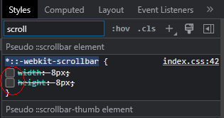

## chrome打印边距处理

有时候chrome打印到pdf会发现内容始终不对齐，导致部分字被右边距挡住了。这时可以：

`ctrl+alt+i`，删掉不想要的div，在最外层div的css上添加：

```css
   margin: 0 auto;
   width: 100%; // 移动端使用
   width: 210mm; // pc端使用
   background: rgb(248, 247, 247);
   overflow: hidden;
   border: 1px solid #eee;
```


## Excel表格

### 文本类型转数值后无法排序问题

解决: 菜单栏选择"开始"->点击"排序与筛选"->选择"自定义排序"->弹出对话框选"扩展指定区域"->下一个对话框选择好"列", "排序依据"->点确定后, 下一个对话框选"将任何类似数字的内容排序".

注意最后这里如果选的是"分别将数字和以文本形式存储的数字排序", 则就会虽然格式变成了数值, 但本身还是"文本形式存储的数字", 所以排序就会按字节序排了.

## curl替代postman

### 一. 基础用法

postman虽然好用, 但是会对图形化界面和安装程序产生强依赖. 其功能其实完全可以由curl及相关的工具进行替代, 这里记录如下:

使用curl发送GET请求：curl protocol://address:port/url?args

```shell
curl http://127.0.0.1:8080/login?admin&passwd=12345678
```

使用curl发送POST请求： curl -d "args" protocol://address:port/url

```shell
curl -d "user=admin&passwd=12345678" http://127.0.0.1:8080/login
```

这种方法是参数直接在header里面的，如需将输出指定到文件可以通过重定向进行操作.

```shell
# curl -H "Content-Type:application/json" -X POST -d 'json data' URL
curl -H "Content-Type:application/json" -X POST -d '{"user": "admin", "passwd":"12345678"}' http://127.0.0.1:8000/login 
```

curl其他用法:

```shell
# 输出http响应体到文件
curl -o ./tt.txt http://www.linux.com

# 下载文件
curl -O http://www.linux.com/hello.sh

# `curl -v`参数会输出请求中访问的路由信息，方便确定是否设置成功，请求有没有代理
```

### 二. 代理

curl使用socks5代理: 这样可以模拟海外客户端进行链接测试; 注意如果是在wsl虚机中连接宿主机v2rayN, 则在v2rayN中需要配置开启`允许来自局域网的连接`. 然后代理服地址指定为宿主机的socks服务地址, 示例如下:

```shell
# -x 参数等同于 --proxy
curl -x socks://127.0.0.1:1080 -L http://x.x.x.x:8090/login -H 'Content-Type: application/json' -H 'passport: xxx' -X POST -d '{"cmd": 0, "pro_id": 424, "bsid": 4240502, "port": 0, "cid": "121212121212"}'
```

也可以设置配置文件, 每次使用`curl`的时候都会使用代理

```bash
# 修改curl配置文件
vim ~/.curlrc
# 写入
socks5 = "127.0.0.1:1024"

# 如果临时不需要代理使用以下参数
curl --noproxy "*" http://www.google.com
```

也可以设置linux全局代理配置, 这不仅仅适用于`curl`，大部分的linux命令行工具都会读取这个配置通过代理访问网络

```shell
# 修改shell配置文件 ~/.bashrc ~/.zshrc等
export http_proxy=socks5://127.0.0.1:1024
export https_proxy=$http_proxy

# 设置setproxy和unsetproxy 可以快捷的开关
# 需要时先输入命令 setproxy
# 不需要时输入命令 unsetproxy
alias setproxy="export http_proxy=socks5://127.0.0.1:1024; export https_proxy=$http_proxy; echo 'HTTP Proxy on';"
alias unsetproxy="unset http_proxy; unset https_proxy; echo 'HTTP Proxy off';"
```

## virtualbox虚机

windows 10下已经有了wsl2, 主要的linux下编辑开发测试功能可以完全在wsl2中进行. virtualbox虚机则用于进行部分比较重量级的特殊实验即可, 如:

1. 测试游戏引擎, 需要中量级的mysql数据库
2. 测试sdn网络, 需要同时启动多个虚拟机
3. ...

这里总结下虚机使用过程中遇到的不大不小的问题

### 虚机迁移目录

1.在全局设定中更改虚拟电脑位置；
2.复制 （移动）现有虚拟机目录到新位置，软件里删除现有虚拟机；
3.菜单栏依次点击“控制”—>“注册”，逐个选择虚拟机目录里的 .vbox文件，导进虚拟机配置 

## 百度脑图

## draw.io: uml/系统架构图绘制

## pdf阅读: foxit-reader

## SwitchyOmega代理设置工具

### 配置文件备份:

```shell
[SwitchyOmega Conditions]
@with result

*.github.io +proxy
*.csdn.com +direct
*.google.com +proxy
*.wikipedia.org +proxy
*.youtube.com +proxy
*.googleapi.com +proxy
*.githubusercontent.com +proxy
*.github.com +proxy
*.googlesource.com +proxy
*.googleusercontent.com +proxy

* +direct
```

## ADBlock广告拦截

规则备份:

```shell

```

## Chrome翻译工具: Mate Translate

## Geany作为跨平台的文件打开编辑器

安装:

* Geany
* Geany plugins
* 第三方插件如[Geany-JSON-Prettifier](https://github.com/zhgzhg/Geany-JSON-Prettifier/releases/tag/v1.6.0), windows平台直接放到`C:\Program Files\Geany\lib\geany`路径下即可.

对插件进行开启, 主要有:

* auto-close
* auto-mark
* JSON Prettifier
* vimode

也可以对配色, 字体, 窗格等进行调整

## 7z加密解密

```shell
7z a -r -mhe -pxxf gosdk.7z gosdk
7z x -pxxf gosdk.7z
```


## 截图: faststone

注册码网上搜索就行.

主要是滚动截取长图, 还是很好用的. 注意, 有些网页修改了滚动条样式, 没有了向下的按键, 不利于截图, 这时可以`Ctrl+Shift+I`调整css样式, 搜索"scroller", 找到长度和宽度去掉勾即可:

